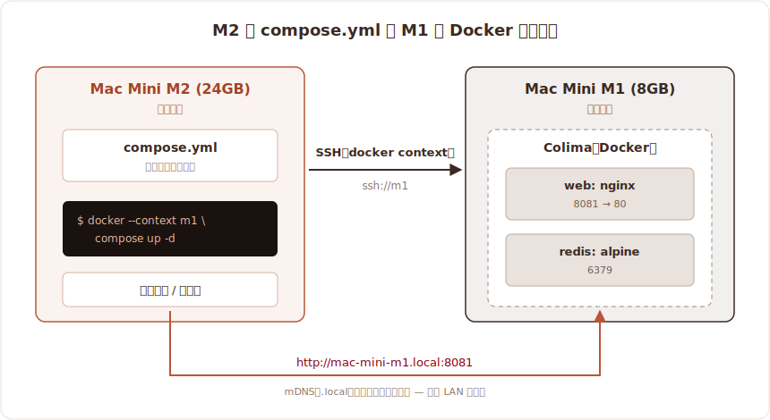

こんにちは、フリーランスエンジニアの太田雅昭です。

## 背景

普段は Mac Mini M2 (24GB) を使用しているのですが、モノレポNext.js開発はすぐにメモリが枯渇してしまいます。SSDなので速度的にはそれほど問題はないのですが、大量書き込みによる寿命劣化が気になります。夢はMac Studioですが、メモリ高騰のこのご時世厳しいものがあります。そこで以前使っていた Mac Mini M1 (8GB) を引っ張り出してきて、こいつをどうにかできないかと思い立ったわけです。

## マシン構成

- 普段使い: Mac Mini M2 (24GB)
- アシスト: Mac Mini M1 (8GB)

## 戦略

DockerをM1で動かし、M2から呼び出す形にします。接続が`localhost`から`xxx.local`に変わる想定です。基本的にはClaude Code頼みとなります。



## 手順

- M2から接続する
- M1を整備する
- M2のcompose.ymlをM1で起動する
- M2からホスト名でサービスにアクセスする

### M2から接続する

これが一番の山場となります。M2から繋げるためにまずClaude Codeを使える状態にします。モニター・キーボード・マウスを接続しました。

ずっと使ってなく脆弱性の宝庫のはずなので、真っ先にMac OSをアップデートします。そのあとはClaude Codeをインストールし、ログインを完了させます。

M2から接続できるように、M1のClaude Codeにお願いしました。M2の公開鍵を要求されました。泣く泣くキーボードとマウスを往復させながら（モニタは幸い２つ体制）、M2から公開鍵をMacのメモ経由で送信します。あとはM1のClaude Codeがよしなにやってくれました。

キーボードとマウスをM2に戻し、準備万端です。

M2からSSHでM1に接続できるようになりました。このままだとコマンドが面倒ですので、今後の利便性を考え、`ssh m1`でできるようにconfigを書きました（AIが）。なおIPではなくホスト名で指定しています（ホスト名をMac-mini-m1.localに変更した）

なおWi-Fi接続でやっています。ルーターは自分専用なので問題ありませんが、もし共用ルーターの場合は、セキュリティを考えて有線が良いと思います。

### M1を整備する

ここからはM2のClaude CodeからSSH接続でM1を操作できます。こうなればしめたものです。まずは古いアプリケーションやデータなどを掃除してもらいました。XCodeなどもM1には不要なので削除しました。最終的にVolumeが24%程度になり、満足です。

続いて`brew`などもろもろアップデートしました。壊しても良い環境の整理は脳汁がたくさん出ました。

Colimaをインストールします。これはDocker Desktopの代わりになります。CLI駆動しか使わないため、Colimaを採用した次第です。`colima start`で起動しておきます。

### M2のcompose.ymlをM1で起動する

M1のcompose.ymlをM1のDockerで動かすのは簡単です。同じマシンだからです。しかしM2のcompose.ymlをM1のDockerで動かすにはどうすれば良いのでしょう。

Dockerにはcontextという機能があります（AIに教えてもらいました）。下記のコマンドを打つことで、実行側のコンテキストを持ちながらSSHの向こう側のDockerを起動することができます。なお`ssh m1`で繋がるようにsshのconfigを設定してあります。

```sh
docker context create m1 --docker host=ssh://m1
docker --context m1 ps      # ← 向こうのコンテナ一覧が出る
```


#### ハマりどころ: 非対話シェルの PATH

最初これが `command not found: docker` で失敗しました。非対話で実行している関係から、Homebrew の `/opt/homebrew/bin` が PATH に乗らないのが原因です。

そこで`~/.zshenv`に下記を追加しました。これで非対話でもbrewのPATHが乗ることになります。

```sh
# M1 の ~/.zshenv（新規作成）
if [[ ":$PATH:" != *":/opt/homebrew/bin:"* ]]; then
  export PATH="/opt/homebrew/bin:$PATH"
fi
```

```sh
# 確認
ssh m1 'docker --version'   # Docker version 29.5.2 → PATH 通った
docker --context m1 ps      # OK
```

### 普段使い用のエイリアス

M2の `~/.zshrc` に下記を追加しました。

```sh
alias dockerm1='docker --context m1'
```

これで、下記のように使えます。便利ですね。

```sh
dockerm1 compose up -d
```

## テストしてみる

`compose.yml`をM2に置いたまま、コンテナは M1 で動かせます。

```yaml
# 手元の docker-compose.yml
services:
  web:
    image: nginx:latest
    ports:
      - "8081:80"
  redis:
    image: redis:alpine
    command: ["redis-server", "--save", "", "--appendonly", "no"]
```

```sh
dockerm1 compose -f ./docker-compose.yml up -d
dockerm1 compose ps
# コンテナの中身を覗くと VM の Linux:
dockerm1 exec <web-container> uname -a   # aarch64 GNU/Linux
```

### （AI様より）注意点

- bind mount（`./foo:/bar`）のパスは “向こうのファイルシステム” 基準で解決されます。手元のファイルは見えないので、ローカルファイルをマウントしたいなら named volume にするか、事前にサーバへ転送が必要です。
- `build:` のビルドコンテキストは手元から tar で送られるので、そのまま動きます。

## サービスにアクセスしてみる

Dockerサービスにアクセスするには、通常`http://localhost:8080`といった形です。しかし今回は同じLAN内にあるので、`http://xxx.x.x.x:8080`のようにIPアドレスでアクセスするか、あるいは`http://xxx.local:8080`といったホスト名でアクセスすることになります。IPアドレスは変化するため、ホスト名が無難です。ただしLANがプライベートであることに注意してください。

### （AI様より）「ネット上に同名ホストがあったら？」— mDNS の安心と注意

`.local` は RFC 6762（mDNS）の予約 TLD で、リゾルバは**通常の DNS には一切問い合わせず**、ローカルリンクへのマルチキャストでだけ名前を尋ねます。

- → **同じ LAN にいる機器しか応答できない**。インターネット上の同名ホストとは混ざらない（到達も誤接続もしない）。
- → 同一 LAN 内で名前が衝突した場合は、Bonjour が後発を `...-2.local` に**自動リネーム**する。

ただしセキュリティ上の事実として:

- **mDNS は認証が無い**。信頼できない LAN では応答を詐称される余地がある。
- **SSH / docker context は安全側**。known_hosts のホスト鍵をピン留めしているので、詐称先に当たると鍵不一致で**繋がらない**。
- **素の HTTP / プレーン DB は無防備**。TLS 等が無いと詐称先に繋がる余地がある → 信頼できる LAN 前提で使うのが無難。
- IP 直指定にも落とし穴: サーバがオフラインの隙に DHCP がその IP を**別端末へ再割り当て**すると、IP アクセスが別マシンに当たることがある。名前ベースの方が同一性は保ちやすい。

## まとめ

今回は別マシンでDockerを動かしてみました。ローカルコンテキストを渡せるのかと目から鱗でしたが、AI様のおかげで全体を通してすんなりと実現できました。
