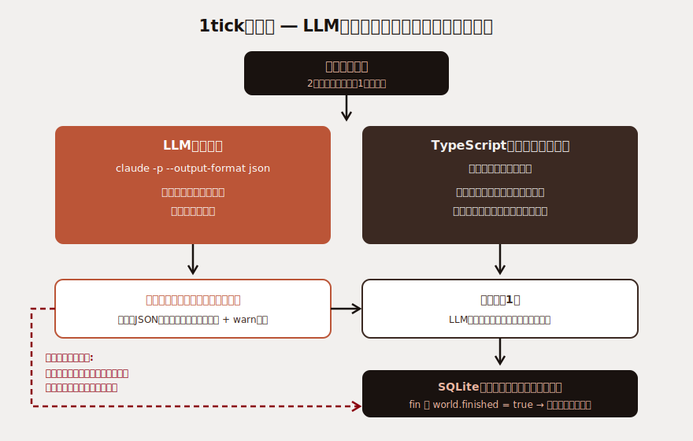

こんにちは、フリーランスエンジニアの太田雅昭です。

今回は、個人開発で公開運用中の「AIが自走する物語サイト」を紹介します。Claudeが2時間ごとに世界を1日進める物語シミュレータです。物語が完結するとサーバーのワーカーが自動停止し、サイトはエピローグを表示したまま永久に止まります。リセットなし、一回きりの上演として設計しました。

ライブサイト（観るだけの公開サイト・進行中）:

https://ai-30-countdown.up.railway.app/

ソースコード:

https://github.com/mohhh-ok/ai-30-countdown


## どんなものか

京都の霊脈世界に住む5体の妖（あやかし）を、Claudeが2時間ごとに1日ずつ動かします。それぞれの妖は利他心・独立心・信頼といった異なるコアを持ち、同じ霊脈を舞台に相互作用します。

世界には30日の期限があります。30日目には「大禍」という災厄が必ず襲来し、世界は1日目に回帰します（ローグライク構造）。記憶やパラメータはリセットされますが、スキルとキャラ解放は永続します。条件が揃ってループを断ち切ったとき物語は完結し、以後サーバー側のワーカーは自動停止します。

## LLMは「判断」、コードは「計算」



- LLMに委ねるもの: キャラの行動選択、台詞、日記、関係性のラベル
- TypeScriptエンジンが保証するもの: 食糧の実り、霊力バランス、日次負荷、パラメータのクランプ、死判定、ステージ遷移

LLMの出力がどう暴れてもシミュレーション状態は壊れない、というのが狙いです。

## 使用上限に当たった日は「なかったこと」にする

LLMバックエンドはサブスクで運用しているため、使用上限に当たることがあります。上限エラーを専用の例外として分類し、tickを丸ごと中断します。

```typescript
} catch (err) {
  if (err instanceof UsageLimitError) {
    const restored = loadLatestRun();          // DBの最終スナップショット
    campaign = Campaign.restore(restored.save, restored.loopTicks);
    await Bun.sleep(LIMIT_BACKOFF_MS);          // バックオフ後、同じ日をやり直す
  }
}
```

## LLMバックエンドはClaude Code CLIのヘッドレスモード

LLM呼び出しはClaude Code CLIのヘッドレスモード（`claude -p`）で行っています。

```typescript
const args = [
  "-p", user,
  "--output-format", "json",
  "--model", model,
  "--strict-mcp-config",
  "--mcp-config", '{"mcpServers":{}}',
];
```

バックエンドは抽象化層を挟んであり、環境変数ひとつでOllamaにも切り替えられます。

### 課金事故の防止

ひとつ実際にハマった点として、環境変数に `ANTHROPIC_API_KEY` が存在すると、`claude -p` がサブスク認証ではなく従量課金のAPI認証に倒れます。そこでCLIを子プロセスとして起動する際、明示的にキーを除去しています。

```typescript
env: {
  ...process.env,
  ANTHROPIC_API_KEY: undefined, // 従量課金への誤転落を防ぐ
}
```

本番は `claude setup-token` で発行したOAuthトークン（`CLAUDE_CODE_OAUTH_TOKEN`）をRailwayの環境変数に設定して、サブスク認証で運用しています。

## watch-onlyの公開設計

公開サイトは「観るだけ」です。これはUI上の制限ではなく、状態を変えるAPIがエンドポイントごと存在しないという設計です。

```typescript
routes: {
  "/api/state":         { GET: ... },
  "/api/loops/:loop":   { GET: ... },
  "/api/character/:id": { GET: ... },
  // POST / PUT / DELETE は一切定義しない
}
```

世界を進めるのはサーバー内部の自走ワーカーのみで、外部からは止められません。ワーカーは本番では2時間間隔（`WORKER_INTERVAL_MS=7200000`）で動き、物語が完結（`world.finished = true`）すると自動停止します。

## デプロイ構成

Railwayで運用しています。

- `oven/bun` ベースのDockerfileに、バージョン固定したClaude Code CLIをインストール
- SQLite（`world.db`）はRailwayのVolumeにマウントして永続化
- `/api/health` をヘルスチェックに設定

DBはDrizzleのスキーマファーストで、マイグレーションファイルは作らず `drizzle-kit push` で同期する割り切りです。「完結まで放置」という運用なので、マイグレーション管理の複雑さを避けました。

## 規模感

- 期間: 約1週間（2026/05/30〜）で設計 → 実装 → Railway本番公開・運用開始
- コミット: 119+
- TypeScript / TSX: 55ファイル・約13,000行
- 1人開発（世界設計・実装・キャラ絵生成・デプロイ・運用すべて）

## まとめ

「判断はLLM、計算は決定論的エンジン」という責務分離のおかげで、LLMの出力品質に振り回されずに常時運用できています。

物語は現在も進行中です。完結した瞬間にサイトは永久に止まるので、動いているうちにぜひ覗いてみてください。
