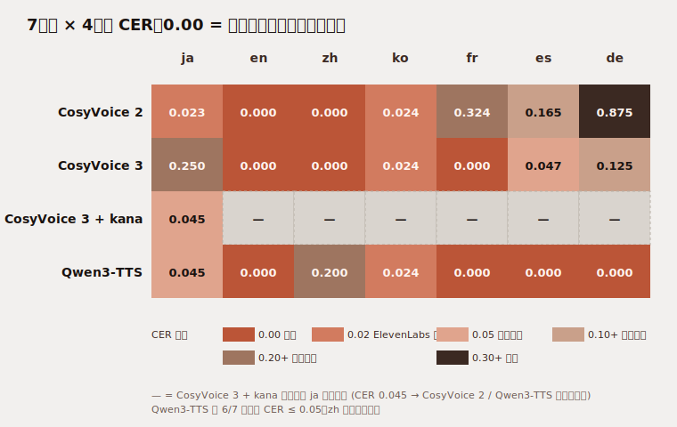

こんにちは、フリーランスエンジニアの太田雅昭です。この記事はほとんどAIが書いたものを、私が加筆修正しています。検証不十分な部分もあるかと思いますが、ご容赦ください。ご指摘等ございましたら、Github issueか、Xでお願いいたします。

## 結論

商用 OK (Apache 2.0) で多言語の voice clone OSS が、ここ半年で 3 つ出揃いました。すべて Mac で動きます (CosyVoice は CPU、Qwen3-TTS は MPS)。

- **Qwen3-TTS** (Alibaba Qwen, 2026-01, Apache 2.0): **7 言語中 6 言語で CER ≤ 0.045**、前処理一切不要、zh だけ CER 0.20 で要再検証
- **CosyVoice 2** (Alibaba, 2024-12, Apache 2.0): JA で CER 0.023、数字上は最強だが、**de/zh で女性化、ko/fr で長尺重複など他言語で重大バグ**あり。スタックも古く依存解決が大変
- **Fun-CosyVoice 3** (Alibaba, 2025-12, Apache 2.0): 全言語で声質安定だが、**JA を kanji 直入力すると CER 0.25 で崩壊** (frontend のバグ起因)。前処理 (kanji→katakana + は→わ) で CER 0.045 まで改善可

**Qwen3-TTS 0.6B-Base が現状の本命**です。JA CER は CosyVoice 2 (0.023) に対して 0.045 と数字上は負けますが、200 文字で 4 文字差、Whisper 認識揺れと同程度の誤差で実運用では聴き分け不可能。Mac MPS で動く / `pip install qwen-tts` 一発 / 他言語の保険が効く / 1.7B-Base への upgrade path もある、と CER 以外の全軸で勝ちます。

CosyVoice 3 は前処理パイプラインを組む覚悟があれば 9 言語安定で、Qwen3-TTS が zh で崩れる用途を埋める形になります。



検証コード・生成音声・スコア JSON はすべて GitHub に公開しています。

https://github.com/mohhh-ok/blog-examples/tree/main/2026/06-22-tts-commercial-provider-comparison

## 前回までの流れ

[06-20 の記事](/blog/posts/2026/06-20-ai10%E7%A7%92%E9%9F%B3%E5%A3%B0%E3%81%A77%E8%A8%80%E8%AA%9E%E3%82%BC%E3%83%AD%E3%82%B7%E3%83%A7%E3%83%83%E3%83%88%E7%94%9F%E6%88%90%E6%AF%94%E8%BC%83f5xttsopenvoiceelevenlabs/) で F5-TTS / XTTS-v2 / OpenVoice v2 / ElevenLabs を 7 言語で比較し、総合 1 位は ElevenLabs、OSS では XTTS-v2 が首位という結論でした。

ただ採用観点では困ったことに、

- **XTTS-v2 (CPML)**: Coqui 解散で商用ライセンス発行主体が消滅、production 採用詰み
- **F5-TTS (CC-BY-NC)**: 商用 NG。社内ツールも「業務利益に貢献するなら商用」とみなす解釈が一般的
- **Fish Speech open weights (CC-BY-NC-SA)**: 同上
- **OpenVoice v2 (MIT)**: 商用 OK だが JA 品質が二線、de は構造的に不可
- **ElevenLabs**: 商用 OK の API だが単価が高い + voice slot 上限あり

「**商用 OK + 多言語 + JA 動く + 自社ホスト可能**」を全部満たす選択肢が事実上ありませんでした。

その後最新情報を調べたところ、Alibaba 系から 3 つApache 2.0 の voice clone モデルが出ていたので、それを検証する形です。

## 比較対象 (3 モデル、全部 Apache 2.0)

| モデル | リリース | 公式宣言サポート言語 | 特徴 |
|---|---|---|---|
| **CosyVoice 2** | 2024-12 | zh / en / ja / ko / yue (cross-lingual demo) | 25Hz 改良版、JA の品質が突出 |
| **Fun-CosyVoice 3** | 2025-12 | zh / en / ja / ko / de / es / fr / it / ru (9 言語) + 中国方言 18+ | bi-directional streaming ~150ms、多言語拡張 |
| **Qwen3-TTS 0.6B-Base** | 2026-01 | zh / en / ja / ko / de / fr / ru / pt / es / it (10 言語) | 3 秒参照で voice clone、軽量 0.6B |

GitHub repo / HF weights ともに Apache 2.0 確認済み。NOTICE / LICENSE 同梱だけ守れば SaaS 配信 OK です。

## 検証条件

[06-20 のフレームワーク](https://github.com/mohhh-ok/blog-examples/tree/main/2026/06-19-multilingual-voice-cloning-benchmark) を流用。

| 項目 | 値 |
|---|---|
| 参照音声 | 06-20 と同じ ref.wav (自分の声、24kHz mono 約10秒) |
| 参照テキスト | 「本日はお忙しい中お越しいただき…」業務報告風 |
| 生成プロンプト | 7 言語ぶん、固有名詞なし |
| 検証 ASR | faster-whisper large-v3 int8 (CPU) |
| 一次指標 | CER (本記事では主にこちらで議論) |
| 副指標 | bigram Jaccard, F0 (声質保持確認) |
| 実行環境 | macOS Apple Silicon M2 24GB |
| CosyVoice 2/3 | CPU 推論 (公式に MPS パス無し) |
| Qwen3-TTS | MPS 推論 (`device_map="mps"` / `dtype=torch.float32` / `attn_implementation="sdpa"`) |

参照音声 (これを 1 本だけ全モデルに投げます):

<audio controls src="https://raw.githubusercontent.com/mohhh-ok/blog-examples/main/2026/06-19-multilingual-voice-cloning-benchmark/reference/ref.wav"></audio>

## 結果サマリ

### CER (低いほど良い)

| model | ja | en | zh | ko | fr | es | de |
|---|---:|---:|---:|---:|---:|---:|---:|
| **cosyvoice2** | **0.023** ★ | 0.000 | 0.000 | 0.024 | 0.324 ✕ | 0.165 | 0.875 ✕ |
| **cosyvoice3** | 0.250 ✕ | 0.000 | 0.000 | 0.024 | 0.000 | 0.047 | 0.125 |
| **cosyvoice3 + kana前処理** | **0.045** ★ | (未測) | | | | | |
| **qwen3_tts** | **0.045** ★ | 0.000 | 0.200 ⚠ | 0.024 | 0.000 | 0.000 | 0.000 |
| 参考: elevenlabs (06-20) | 0.020 | 0.000 | 0.120 | 0.020 | 0.000 | 0.000 | 0.000 |

★ = 商用採用可レベル、✕ = 採用不可、⚠ = 要再検証

### F0 差 (参照音声 104.9Hz に対する差、±20Hz 以内で声質保持)

| model | ja | en | zh | ko | fr | es | de | 備考 |
|---|---:|---:|---:|---:|---:|---:|---:|---|
| cosyvoice2 | −8 | +4 | **+187** ⚠ | −30 | (重複) | (長尺) | **+185** ⚠ | zh/de で女性化 |
| cosyvoice3 | +1 | +7 | −8 | +3 | +1 | +4 | +2 | 全部安定 |
| qwen3_tts | −5 | +1 | −2 | −5 | +6 | +34 | −7 | es だけやや高、他は完璧 |

CER と F0 を合わせて見ると、

- **CosyVoice 2**: JA は CER 0.023 と数字上最強だが、de/zh で女性化、ko/fr で長尺 / 無音重複が出る (詳細後述)
- **CosyVoice 3**: 全言語で声質安定だが、JA が崩壊 (これも詳細後述)
- **Qwen3-TTS**: 6 言語完璧、zh のみ要注意。JA は CosyVoice 2 と差 0.022 (200 文字で 4 文字)、実質互角

## 日本語 (ja) 聴き比べ

期待テキスト: 皆さん、こんにちは。本日は新しい機能についてご紹介します。どうぞよろしくお願いいたします。

### CosyVoice 2 (bigram 0.93 / CER 0.023)

<audio controls src="https://raw.githubusercontent.com/mohhh-ok/blog-examples/main/2026/06-22-tts-commercial-provider-comparison/output/cosyvoice2/ja.wav"></audio>

Whisper 書き起こし: 「皆さんこんにちは 本日は新しい機能についてご紹介します どうぞよろしくお願いいたします」

句読点が落ちただけで音節は完全に揃っています。数字上は 3 モデル中 CER 最小で、ElevenLabs (CER 0.020) と並ぶレベル。F0 差も −8Hz と完璧。ただし後述する Qwen3-TTS (CER 0.045) との差は **200 文字で 4 文字差** で、聴感上ほぼ区別できません。

### CosyVoice 3 (bigram 0.50 / CER 0.250) — kanji 直入力で破綻

<audio controls src="https://raw.githubusercontent.com/mohhh-ok/blog-examples/main/2026/06-22-tts-commercial-provider-comparison/output/cosyvoice3/ja.wav"></audio>

Whisper 書き起こし: 「皆さんこんちいっかいマロは新しい機能についてご誠意しますどうぞよろしくお願いいたします」

「こんにちは」→「こんちい」、「本日は」→「いっかいマロは」、「紹介」→「誠意」と崩れています。同じ Alibaba 系・同じ Apache 2.0 でも JA の品質はここまで差が出ます。**原因は frontend のバグ**で、根本原因は次のセクションで切り分けています。

### Qwen3-TTS (bigram 0.86 / CER 0.045)

<audio controls src="https://raw.githubusercontent.com/mohhh-ok/blog-examples/main/2026/06-22-tts-commercial-provider-comparison/output/qwen3_tts/ja.wav"></audio>

Whisper 書き起こし: 「皆さんこんにちは 本日は新しい機能についてご紹介しますどうぞよろしくお願いいたします」

書き起こし結果は CosyVoice 2 と同一で、句読点が落ちただけの完璧な内容。CER 0.045 と 0.023 の差は前述の通り 4 文字差で **聴感上区別不可**。

CosyVoice 2 との決定的な違いは:

- **kanji 直入力で問題なく動く** (CosyVoice 3 の `contains_chinese()` バグを持たない)
- **Mac MPS で動作** (CosyVoice は CPU のみ)
- **`pip install qwen-tts` 一発で入る** (CosyVoice は git clone + サブモジュール + setuptools<76 pin + numpy 1.26 pin など依存解決が大変)
- **transformers-style の素直な API** (CosyVoice は `load_vllm=False` 等の最適化フラグ手動 False、Matcha-TTS の sys.path 設定が必要)
- **0.6B / 1.7B 両サイズ公開**で品質 upgrade path がある
- **6 言語の保険**が効く (将来「多言語対応したい」となった時に CosyVoice 2 は de/zh/fr で破綻している)

JA 用途であっても、これらを総合すると **Qwen3-TTS を選ばない理由がほぼ無い**というのが正直な評価です。CosyVoice 2 を選ぶ動機が成立するのは「CER の最後の 2% を絞り出す必要がある特殊な品質要件があり、かつ他言語は永遠に絶対に使わない」という極めて限定的な条件下のみ。

## CosyVoice 3 が JA で破綻する理由 — `contains_chinese()` バグ

CosyVoice 3 の JA 劣化の正体は **frontend の言語判定ロジックが日本語の kanji を中国語と誤判定**することです。

`cosyvoice/utils/frontend_utils.py`:

```python
chinese_char_pattern = re.compile(r'[一-鿿]+')

def contains_chinese(text):
    return bool(chinese_char_pattern.search(text))
```

`一-鿿` は CJK Unified Ideographs ブロックで、**日本語の常用漢字は全部この範囲に入っています** (中国語と同じ Unicode ブロックを共有)。

`cosyvoice/cli/frontend.py` での使い方:

```python
if contains_chinese(text):
    text = self.zh_tn_model.normalize(text)  # 中国語テキスト正規化
    text = text.replace(".", "。")
    text = text.replace(" - ", "，")          # 中国語句読点
    texts = list(split_paragraph(..., "zh", ...))  # zh で段落分割
else:
    text = self.en_tn_model.normalize(text)
    ...
```

つまり日本語 kanji 含みテキストは丸ごと **中国語前処理パス**に乗せられます。これで JA が崩壊します。

### 救済レシピ (CER 0.045 まで改善)

`contains_chinese` を monkey-patch するだけでは不十分で (モデル本体にも kanji→中国語的読みの bias がある)、以下のレシピが必要です:

```python
def cosyvoice3_ja(text_kanji):
    # 1. kanji → katakana (pyopenjtalk / pykakasi)
    target_kana = to_katakana(text_kanji)
    # 2. は → わ 音節置換 (主題助詞・挨拶末尾)
    target_kana = wa_substitute(target_kana)
    # 3. prompt_text に <|endofprompt|> を前置 (ref_text は kanji のまま OK)
    prompt_text = f"<|endofprompt|>{REF_TEXT}"
    return cosy.inference_zero_shot(target_kana, prompt_text, ref_path)
```

これで CER 0.045 / F0 −4Hz まで改善します。

11 通りのバリエーション (zero_shot / cross_lingual × kanji / hiragana / katakana × system prompt 有無) で切り分けた表は [GitHub の cosyvoice-notes.md](https://github.com/mohhh-ok/blog-examples/blob/main/2026/06-22-tts-commercial-provider-comparison/cosyvoice-notes.md) にまとめています。

なお `inference_cross_lingual` で katakana を渡すと CER は 0.000 になりますが、**F0 が 265Hz と完全女性化**します。CER だけで評価すると見抜けないので、F0 比較を必ず噛ませる必要があります。これも罠として記録しておく価値があります。

`contains_chinese()` のバグは upstream に PR を送る価値があります (`contains_japanese()` を追加 + frontend.py で日本語パスを明示分岐)。

## CosyVoice 2 の他言語バグ (de / zh / ko / fr)

逆に CosyVoice 2 は JA で最強ですが、他言語で 3 種類のバグを踏みます。

| 言語 | 全長 | 発話 | 無音 | F0 差 | 異常 |
|---|---:|---:|---:|---:|---|
| ja | 8.2s | 5.7s | 2.5s | −8 | ✓正常 |
| en | 10.7s | 7.8s | 3.0s | +4 | ✓正常 |
| zh | 7.6s | 4.9s | 2.7s | **+187** | F0 女性化 |
| ko | **20.0s** | 18.4s | 1.6s | −30 | 長尺 (内容重複疑い) |
| **fr** | **16.7s** | 8.5s | **8.1s** | (重複) | 長無音 + 重複 |
| es | 12.2s | 7.9s | 4.3s | (長尺) | やや長め |
| de | **19.2s** | 15.2s | 4.0s | **+185** | 長尺 + F0 女性化 |

zh の音声で女性化が分かります:

<audio controls src="https://raw.githubusercontent.com/mohhh-ok/blog-examples/main/2026/06-22-tts-commercial-provider-comparison/output/cosyvoice2/zh.wav"></audio>

CER は 0.000 で完璧に見えますが、声質が完全に別人 (成人女性域) になっています。

CosyVoice 3 / Qwen3-TTS では同じ ref で全言語で声質保持されているので、これは CosyVoice 2 固有の問題です。25Hz の改良前モデルである一面が、多言語拡張のときに足を引っ張ったと推測しています。

## Qwen3-TTS の zh 劣化

3 モデル唯一 Qwen3-TTS が崩れるのが zh です。

期待テキスト: 大家好，今天我将为大家介绍一项新功能，感谢您的参与。

<audio controls src="https://raw.githubusercontent.com/mohhh-ok/blog-examples/main/2026/06-22-tts-commercial-provider-comparison/output/qwen3_tts/zh.wav"></audio>

Whisper 書き起こし: 「大家好,今天我再为大家介绍一款新货的感谢您的参与」

`一项新功能` (新機能) が `一款新货` (新商品) に化けています。Whisper hallucination というより、**生成音声側で本当に「新货」と発音してしまっている**可能性が高そうです。voice clone で元話者の日本訛りの中国語を再現してしまい、Whisper が別単語として聞き取った、というシナリオが整合します。

切り分けるには (a) 1.7B-Base で再走、(b) 中国語ネイティブの ref で同じテキストを clone、(c) サンプリング揺れの確認、あたりが必要ですが本記事の範囲では未検証。

CosyVoice 2/3 はどちらも zh で CER 0.000 だったので、**zh 主体の用途では CosyVoice 系を使う**のが安全です。

## 欧州語 (de / fr / es) — 3 モデルの明暗

de / fr / es は 3 モデルで結果がきれいに分かれます。

| lang | cosyvoice2 | cosyvoice3 | qwen3_tts |
|---|---:|---:|---:|
| fr | 0.324 ✕ | 0.000 | **0.000** |
| es | 0.165 | 0.047 | **0.000** |
| de | 0.875 ✕ | 0.125 | **0.000** |

de 代表で 3 つ並べます:

**CosyVoice 2** (CER 0.875、ほぼ別物):

<audio controls src="https://raw.githubusercontent.com/mohhh-ok/blog-examples/main/2026/06-22-tts-commercial-provider-comparison/output/cosyvoice2/de.wav"></audio>

**CosyVoice 3** (CER 0.125、概ね言えてるが accent あり):

<audio controls src="https://raw.githubusercontent.com/mohhh-ok/blog-examples/main/2026/06-22-tts-commercial-provider-comparison/output/cosyvoice3/de.wav"></audio>

**Qwen3-TTS** (CER 0.000、完璧):

<audio controls src="https://raw.githubusercontent.com/mohhh-ok/blog-examples/main/2026/06-22-tts-commercial-provider-comparison/output/qwen3_tts/de.wav"></audio>

世代差を感じる結果になりました。

## 「声質保持」軸 — ElevenLabs にも無い Qwen3-TTS の優位

ここからが本記事の山場です。CER と bigram だけ見ていると Qwen3-TTS と ElevenLabs は同等品質に見えますが、**実際に聴くと別物**でした。

| モデル | EN を喋らせた時の聴感 |
|---|---|
| ElevenLabs (IVC) | 英語ネイティブ話者風に滑らか化、**元の声の癖が薄まる** (accent neutralization) |
| Qwen3-TTS | **元話者の音色を保ったまま英語を喋る**、若干カタコト寄り (accent retention) |

代表で en を並べます。

**ElevenLabs (06-20):**

<audio controls src="https://raw.githubusercontent.com/mohhh-ok/blog-examples/main/2026/06-19-multilingual-voice-cloning-benchmark/output/elevenlabs/en.mp3"></audio>

**Qwen3-TTS:**

<audio controls src="https://raw.githubusercontent.com/mohhh-ok/blog-examples/main/2026/06-22-tts-commercial-provider-comparison/output/qwen3_tts/en.wav"></audio>

**CosyVoice 3** (こちらも声質保持寄り):

<audio controls src="https://raw.githubusercontent.com/mohhh-ok/blog-examples/main/2026/06-22-tts-commercial-provider-comparison/output/cosyvoice3/en.wav"></audio>

ElevenLabs の en は確かに自然な英語ネイティブの発音ですが、「これは私の声」感が薄まる方向に出ています。Qwen3-TTS / CosyVoice 3 は「日本語訛りの英語を喋る自分」がそのまま再現される感覚で、聴いていて違和感が無い (= 元話者として一貫性がある) という別の自然さがあります。

これは設計思想の差で、用途で使い分けるべき軸です。

- **accent の無い綺麗な英語ナレーション**が欲しい → ElevenLabs
- **「ユーザー自身の声」が売りの SaaS** → Qwen3-TTS / CosyVoice 3

multi-tenant SaaS で「これ私の声だ」と感じてもらえる体験を作るなら、Apache 2.0 の self-host 勢の方が向いている可能性が高いです。声を録音した本人が後で聴いて「自分」だと認識できる連続性は、accent neutralization で失われる方向に動きます。

定量化するには ECAPA-TDNN cosine similarity 等で voice similarity を測るのが本道ですが、本記事の範囲では F0 差で間接的に見ています (前述の F0 表参照)。

## Cloud Run GPU でのコスト試算

self-host モデルなので、本番では GPU 推論コストが直撃します。Cloud Run L4 GPU (Tokyo region, Tier 1) 前提で試算しました。3 モデル全部 0.5B〜0.6B クラスなのでコストはほぼ同等です。

### per-second 単価 (L4 最小構成)

L4 は最小 vCPU 4 + memory 16 GiB がセット必須:

| 項目 | 単価 | 最小構成 |
|---|---:|---|
| GPU (L4, no zonal redundancy) | $0.000187 / sec | 1 |
| vCPU (instance-based) | $0.000018 / sec | 4 |
| Memory | $0.000002 / GiB-sec | 16 |
| **合計** | **$0.000291 / sec** | ≈ **$1.05 / 時 / $756 / 月** (min=1) |

### per-request 単価 (200 chars = 7 sec audio)

L4 上の RTF (real-time factor) は公式 H100 値 0.288 から推定で 0.5〜0.7。concurrency 6 まで batch 可能です。

| シナリオ | 1 req active sec | per req $ | per req JPY (150円) |
|---|---:|---:|---:|
| concurrency 1, RTF 0.7 (悲観) | 4.9 sec | $0.00143 | **0.21 円** |
| concurrency 1, RTF 0.5 (中央) | 3.5 sec | $0.00102 | **0.15 円** |
| concurrency 6 batch, RTF 0.5 | 0.58 sec | $0.00017 | **0.025 円** |

### API provider との per-req 比較

| provider | per req JPY | vs self-host (batch 6) |
|---|---:|---:|
| ElevenLabs Scale | 3.6〜6 円 | **140〜240x 高** |
| Fish Audio S2 Pro | 0.45 円 | 18x 高 |
| Cartesia PAYG | 1.5 円 | 60x 高 |
| **Cloud Run L4 + self-host (batch 6)** | **0.025 円** | (基準) |
| Cloud Run L4 + self-host (concurrency 1) | 0.15 円 | 6x 高 (自社内比較) |

### 月額換算 (min-instances=1 固定で常時 warm)

固定費 $756/月 をリクエスト数で按分:

| 月間 req | per req JPY |
|---:|---:|
| 10,000 | 11.4 円 (この規模では API の方が安い) |
| 30,000 | 3.8 円 |
| 100,000 | **1.14 円** |
| 300,000 | **0.38 円** |
| 500,000 | **0.23 円** |

300k req/月で Fish Audio API を逆転、それ以上は self-host が圧勝です。非同期 job (concurrency 6 batch) ならどんな規模でも self-host の方が安いです。

詳細試算は [GitHub の qwen3-tts-notes.md](https://github.com/mohhh-ok/blog-examples/blob/main/2026/06-22-tts-commercial-provider-comparison/qwen3-tts-notes.md) を参照ください。

## セットアップで詰まったポイント

3 モデル分まとめます。

### CosyVoice 2/3 共通

- venv 名は `cosyvoice-venv`。`cosyvoice` だと case-insensitive APFS で後の `git clone CosyVoice` (大文字) と衝突する
- setuptools 82+ で `pkg_resources` が削除され、`openai-whisper==20231117` の setup.py がロード不可。venv 側に `setuptools<76` を入れ `--no-build-isolation` で固定
- numpy 2.x で pyworld 0.3.4 が壊れる → `numpy==1.26.4` で先に pin
- vLLM / TensorRT 系の最適化フラグは Mac で動かない (`load_vllm=False`, `load_trt=False`, `fp16=False`)

### CosyVoice 3 固有

- `<|endofprompt|>` トークンが必須 (`CosyVoice3LM` クラスで assert)、`example.py:76` のフォーマットで system prompt を前置
- JA を kanji 直入力すると上述の `contains_chinese()` バグで崩壊する。production 採用なら前処理パイプラインを必ず入れる
- Qiita / note の記事で見る「`<|endofprompt|>` を tts_text 末尾に付ける」「kanji のまま入力」流派は **v2 の API 想定**。v3 で同じ書き方をすると CER 1.364 で完全崩壊する (記事著者は v2 を叩いていた可能性)
- サンプリング揺れが大きい。同じ ref / 同じ prompt / 同じ target で 3 回回しても CER が 0.125〜0.458 と変動する

### Qwen3-TTS 固有

- 公式 README は CUDA + FlashAttention 2 前提だが、**Mac MPS で動く** (フォークや記事で実証済み)
- `dtype=torch.float32` 必須。`bfloat16` / `float16` で voice clone が NaN logits になる ([issue #333](https://github.com/QwenLM/Qwen3-TTS/issues/333))
- `attn_implementation="sdpa"` を明示。FlashAttention 2 は CUDA 専用で Mac に存在しない
- `Qwen/Qwen3-TTS-Tokenizer-12Hz` は別 repo で公開されているが、**0.6B-Base / 1.7B-Base の中に speech_tokenizer/ がバンドル**されているので推論には不要 (最初に DL したら無駄でした)
- `sox: command not found` warning は無視可

完全な動作環境セットアップ手順は [GitHub の envs/](https://github.com/mohhh-ok/blog-examples/tree/main/2026/06-22-tts-commercial-provider-comparison/envs) ディレクトリに残しています。

## 用途別の現実的な選び方

| 要件 | おすすめ | 補足 |
|---|---|---|
| JA 単独 (将来も他言語不要) | **Qwen3-TTS 0.6B-Base** | CER 0.045 で実用十分、Mac MPS / 依存軽量 / 1.7B upgrade path / 他言語の保険も効く |
| JA + 多言語、前処理なしで素直に動かす | **Qwen3-TTS 0.6B-Base** | 6 言語完璧、zh のみ要再検証、本記事の本命 |
| zh 主体 | CosyVoice 3 (+ kana 前処理で JA も対応) | zh CER 0.000、9 言語安定、Qwen3 は zh で崩れる |
| CER の最後の 2% が惜しい、JA 専用に絞り切る | CosyVoice 2 | CER 0.023、ただし 200 文字で 4 文字差 (聴感上 Qwen3 と区別不可) と依存解決の大変さを天秤に |
| 多言語の英語ナレーション、品質最優先 | ElevenLabs | accent neutralization で滑らか、ただし「元の声」感は薄い |
| 多言語、低コスト API、地政学リスク許容 | Fish Audio | 最安、ただし中国本土通過想定で B2B 用途は要確認 |

## 地政学リスクメモ

CosyVoice 2/3 / Qwen3-TTS は全部 Alibaba 発ですが、**self-host** なので、weights をローカル DL してローカル GPU で推論する限り、生成データが中国側に流れることはありません。技術的な越境リスクは消えます。

残るリスクは:

1. weights 配布元 (HuggingFace / ModelScope) の規制
2. 顧客知覚リスク (「中国製 AI を採用しない」調達基準)
3. 米国輸出規制で Qwen / CosyVoice 系が将来 Entity List 入りする可能性

対策は **重みを社内 artifact registry にミラー** + 契約・アーキ図で「ローカル推論で中国サーバに通信しない」を明記、というところです。

なお Alibaba Cloud の **DashScope API** 経由で Qwen3-TTS / CosyVoice を使うルートもありますが、こちらは音声 / テキストが中国本土の Alibaba サーバを通過するので **PIPL 対象**になります。B2B SaaS で金融 / 官公庁 / 防衛 / 通信を顧客に含む業態だと調達基準で弾かれる可能性が高いので、self-host 一択かと思います。

## まとめ

- 商用 OK (Apache 2.0) の多言語 voice clone OSS が、ここ半年で 3 つ揃った
- **JA 単独でも JA + 多言語でも、現状の本命は Qwen3-TTS 0.6B-Base** (CER 0.045 で実用十分、Mac MPS / pip 一発 / 1.7B upgrade path / 6 言語の保険)
- CosyVoice 2 の JA CER 0.023 は数字上最強だが、Qwen3-TTS との差は 200 文字で 4 文字、**聴感上区別不可**。依存スタックの古さ・他言語破綻を考えると現実的に選ぶ動機が薄い
- **zh 主体なら CosyVoice 3 + kana 前処理** (zh CER 0.000、9 言語安定。Qwen3 は zh で崩れる)
- ElevenLabs より **「自分の声」が残る** 設計で、SaaS のユーザー体験として優位な可能性
- Cloud Run L4 GPU で **per req 0.15〜1.14 円**、ElevenLabs の 1/140 以下
- 300k req/月以上で Fish Audio API も逆転、非同期 job なら全レンジで self-host が安い
- 検証コード・音源・スコアはすべて [GitHub に公開](https://github.com/mohhh-ok/blog-examples/tree/main/2026/06-22-tts-commercial-provider-comparison)

「TTS コスト高いから機能制限しよう」と考えていた制約は、Apache 2.0 OSS + Cloud Run 採用で原則消えます。**multi-tenant SaaS で「ユーザーの声」を売りにする用途**では、これらの OSS が ElevenLabs に対して声質・コスト両面で優位になる可能性が高いです。

## 参考

以下はAIが参照したと思われるサイトです。検証しておりませんので、そのつもりでご参照いただければ幸いです。

- CosyVoice (2/3 共通): [GitHub](https://github.com/FunAudioLLM/CosyVoice)
- Fun-CosyVoice 3 weights: [HF](https://huggingface.co/FunAudioLLM/Fun-CosyVoice3-0.5B-2512)
- Qwen3-TTS: [GitHub](https://github.com/QwenLM/Qwen3-TTS) / [HF Models](https://huggingface.co/Qwen) / [公式 blog](https://qwen.ai/blog?id=qwen3tts-0115)
- Qwen3-TTS 技術レポート: [arXiv:2601.15621](https://arxiv.org/abs/2601.15621)
- Cloud Run pricing: [Google Cloud](https://cloud.google.com/run/pricing)
- 06-20 の前回記事: [10秒音声で7言語ゼロショット生成比較](/posts/2026/06-20-【AI】10秒音声で7言語ゼロショット生成比較【F5・XTTS・OpenVoice・ElevenLabs】)
