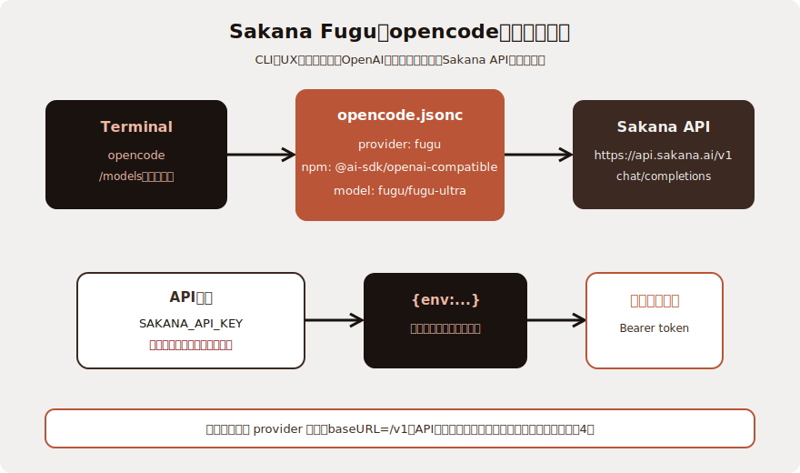

こんにちは、フリーランスエンジニアの太田雅昭です。

## Sakana Fugu

日本の誇るSakana AIが、Mythos級の性能を出したと発表しました。

> Sakana Fugu の性能：定量評価
> 二つのFuguモデルは、一般に利用できるフロンティアモデルを上回り、エンジニアリング・科学・推論のさまざまな難関ベンチマークでも、Fable 5やMythos Previewと肩を並べます。しかも、輸出規制のリスクを負うことなく、フロンティアレベルの実力を発揮します。

https://sakana.ai/fugu/

## なぜOpenCodeか

CLI 派の選択肢を並べると以下です。

| ツール | 形態 | Fugu との相性 |
|---|---|---|
| Cline | VS Code 拡張 | OpenAI 互換を標準サポートだが CLI ではない |
| Codex CLI | CLI (OpenAI 純正) | Sakana 公式が名指し、OpenAI 互換が一級市民 |
| **opencode** | **CLI (OSS)** | **OpenAI 互換プロバイダを JSON 1 個で追加可能。Claude Code に UX が近い** |
| aider | CLI | `--openai-api-base` で対応可。差分提案型 |

私は Claude Code 慣れしているので、UX が一番近い opencode を選びました。



## 設定手順

公式ではCodexの手順は書かれていますが、OpenCodeのそれはありません。そこでOpenCode用に構築する方法をまとめてみました。

### 1. opencode インストール

公式の手順に従ってインストール (省略)。

### 2. API キー発行

Sakana AIサイトでAPIキーを発行します。なお学習のオプトアウトはケースバイケースで設定してください。

### 3. `~/.zshrc` に環境変数

```sh
# Sakana Fugu (opencode 経由で使用)
export SAKANA_API_KEY="ここに発行されたキー"
```

反映:
```bash
source ~/.zshrc
```

### 4. `~/.config/opencode/opencode.jsonc` を編集

opencode は `~/.config/opencode/` 配下の `opencode.json` または `opencode.jsonc` を読みます。インストール時に空の雛形があるはずなので、そこに `provider` ブロックを追記します。

```jsonc
{
  "$schema": "https://opencode.ai/config.json",
  "provider": {
    "fugu": {
      "npm": "@ai-sdk/openai-compatible",
      "name": "Sakana Fugu",
      "options": {
        "baseURL": "https://api.sakana.ai/v1",
        "apiKey": "{env:SAKANA_API_KEY}"
      },
      "models": {
        "fugu": { "name": "Fugu" },
        "fugu-ultra": { "name": "Fugu Ultra" }
      }
    }
  },
  "model": "fugu/fugu-ultra"
}
```

ポイント:

- `npm` に `@ai-sdk/openai-compatible` を指定すると、Vercel AI SDK の OpenAI 互換アダプタが使われます
- `baseURL` は **`/v1` まで含める**。慣例として `chat/completions` の手前までを書きます。`https://api.sakana.ai` だけだと 404 になります
- `apiKey` は `{env:...}` 構文で環境変数を参照可能。リテラルで書かないこと
- `model` をトップレベルに置くと、起動時のデフォルトモデルになります

### 5. 疎通確認 (任意)

opencode を立ち上げる前に curl で API キーと URL の正しさだけ確認しておくと、切り分けが早いです。

```bash
curl https://api.sakana.ai/v1/chat/completions \
  -H "Authorization: Bearer $SAKANA_API_KEY" \
  -H "Content-Type: application/json" \
  -d '{"model":"fugu","messages":[{"role":"user","content":"ping"}]}'
```

200 で `choices[0].message.content` に返答が入っていれば疎通 OK です。

### 6. 起動

```bash
opencode
```

起動後、必要なら `/models` でモデルを切り替え。`fugu` (デフォルト・全プロバイダにルーティング) と `fugu-ultra` (reasoning summaries 付き) の 2 種類があります。

## モデルの使い分け

公式ドキュメントの記述ベースですが、`fugu` モデルには `reasoning.effort` パラメータがあり、`high` と `xhigh` を指定できます。重い推論を投げたいときは `fugu-ultra` を選ぶか、`fugu` に `reasoning.effort: xhigh` を渡す形になります。opencode の `@ai-sdk/openai-compatible` プロバイダがこの reasoning パラメータを透過させるかは別途確認が必要です。

## 注意点

- `~/.zshrc` への平文保存はリポジトリバックアップや画面共有時に注意。気になるなら `1Password CLI` (`op read`) で読む形にしておくのが安全です
- Fugu はオーケストレーション内部で複数モデルを動員するので、1 リクエストあたりのレイテンシ・課金は単一モデルより重い前提で使うこと

## まとめ

- Fugu は OpenAI 互換オンリーなので、Claude Code からは翻訳プロキシ経由でしか使えない
- CLI 派は **opencode に OpenAI 互換プロバイダを足す**のが一番素直
- 必要な作業は `opencode.jsonc` への provider 追記と `SAKANA_API_KEY` の export だけ

Codex CLI も Sakana 公式の本命ですが、Claude Code 慣れの人には opencode のほうが違和感が少ないようです。
