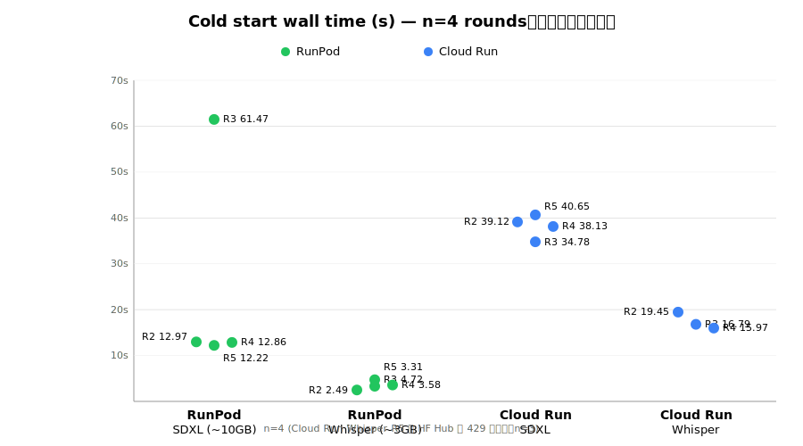

こんにちは、フリーランスエンジニアの太田雅昭です。

「RunPod のほうが cold start 早いと噂だが本当か」を確かめるべく、**同一 workload** で **RunPod Serverless (Network Volume 構成)** と **Cloud Run GPU** を実測しました。

最初 n=1 で回したら SDXL RunPod で 61s の異常値が出て「20 min で cache が失効する」と早合点しかけたので、n=4 に増やして分布で見た結果を書きます。

## 結論 (n=3〜4 の観測範囲での話)

- **RunPod SDXL cold は 4 回中 3 回が 12s 台、1 回だけ 61s** — 短いサンプルで既に 5x のばらつきが出た
- **Cloud Run cold は 4 発とも ±5s に収まった** — この範囲では安定して見えるが、母集団の性質としては未検証
- **中央値では RunPod のほうが速い**が、**今回の最悪ケースは Cloud Run のほうが速かった** (SDXL 61s vs 40s)

## 前提

- **workload 1**: SDXL Base 1.0 (Diffusers, fp16、prompt="A photo of an astronaut riding a horse"、25 steps、1024×1024)
- **workload 2**: Whisper large-v3 (faster-whisper, fp16、30s 英語音声を transcribe)
- **image**: 両者とも `pytorch/pytorch:2.11.0-cuda12.8-cudnn9-runtime` ベース
- **client**: Mac から fetch、東京 → US region で RTT ~150ms
- **測定**: client-side wall clock (fire → response received) を jsonl 記録
- **n=3〜4 per condition**: 統計的信頼区間は取れず、傾向のみ

## 構成の詳細

|項目 | Cloud Run | RunPod Serverless|
|---|---|---|
|GPU | NVIDIA L4 (24GB) | RTX PRO 6000 Blackwell MIG 1g.24gb *|
|Region / DC | us-central1 | US-IL-1|
|Weight 配置 | image bake (~15GB image) | Network Volume STANDARD 20GB (HF から seed)|
|min/max instances | 0 / 1 | 0 / 1|
|Idle 挙動 | scale-to-zero (~15 min) | worker 5s idle で死 + FlashBoot snapshot|

\* RunPod は `gpuTypeIds:["NVIDIA L4"]` を指定しましたが、AMPERE_24 pool (24GB VRAM) の中でスケジューラが Blackwell MIG を割り当てました。純 L4 vs L4 の比較ではないですが、同じ 24GB memory class で、workload 完遂性・応答時間ともに問題なし。

## 4 rounds の cold 実測

|Round | idle | RunPod SDXL | RunPod Whisper | Cloud Run SDXL | Cloud Run Whisper|
|---|---|---|---|---|---|
|R2 | ~2 min | 12.97s | 2.49s | 39.12s | 19.45s|
|R3 | 20 min | **61.47s** | 4.72s | 34.78s | 16.79s|
|R4 | 32 min | 12.86s | 3.58s | 38.13s | 15.97s|
|R5 | 20 min | 12.22s | 3.31s | 40.65s | 500 (\*\*)|

\*\* Round 5 の Cloud Run Whisper は HuggingFace CDN の 429 (試験用 audio URL を全 fire で共有していたため累計 24 回 fetch)。cold start 性能とは無関係で除外。

## Finding 1: RunPod SDXL cold のばらつきが極端

|Round | idle | RunPod SDXL cold |
|---|---|---|
|R2 | ~2 min | 12.97s |
|R3 | 20 min | **61.47s** |
|R4 | 32 min | 12.86s |
|R5 | 20 min | 12.22s |

4 回中 3 回は 12s 台の狭い範囲に固まっていて、R3 だけ 61s。R3 (20 min idle) と R5 (20 min idle) が全く違う値、R4 (32 min idle) は R3 より長い idle なのに速い — **時間だけでは説明できない**。

RunPod docs / community も「FlashBoot の cache eviction は非公開、動的スケジューリング (systemwide の pressure や snapshot LRU 等)」と回答していて、ユーザ側から予測はできません。「たまに遅い、頻度は 1/n」という現象として受け止めるしかない。

## Finding 2: RunPod Whisper は今回の 4 発では跳ねなかった

n=4 とも 2.49-4.72s、max/min = 1.9x。SDXL のような跳ねは観測されず、ただし n=4 なので「Whisper 側は跳ねない」と断定はできず、単に今回引かなかっただけの可能性あり。

## Finding 3: Cloud Run cold は今回の 4 発で ±5s に収まった

|endpoint | n | 実測範囲 | max/min|
|---|---|---|---|
|Cloud Run SDXL cold | 4 | 34.78 - 40.65s | 1.17x|
|Cloud Run Whisper cold | 3 | 15.97 - 19.45s | 1.22x|

RunPod SDXL は同じ 4 発で 5x 変動、Cloud Run は 1.2x 未満に収まった。ただし n=4 なので「Cloud Run cold は本質的に安定」と一般化するには証拠不足で、より長い観測窓と大サンプルが要ります。

## Finding 4: 中央値 vs 最悪ケース (今回の観測範囲)

|endpoint | RunPod median (n=4) | Cloud Run median (n=3-4) | RunPod worst (max) | Cloud Run worst|
|---|---|---|---|---|
|SDXL cold | 12.86s | 38.63s | 61.47s | 40.65s|
|Whisper cold | 3.44s | 16.79s | 4.72s | 19.45s|

**今回の中央値では RunPod のほうが速い**。ただし **SDXL の最悪ケースは Cloud Run のほうが速かった** (61s vs 40s)。ユーザ体感の p50 なら RunPod、tail に耐える設計を組むなら Cloud Run — ただしこの判断は n=4 の一時観測に基づくので、production 前に自環境で追試推奨。

## Finding 5: Registry proximity は罠

同じ SDXL image で構成を変えて cold を測ると:

|構成 | 場所 | cold|
|---|---|---|
|image bake (Round 1) | 15GB image を us-central1 AR → RunPod US-NE-1 に pull | 207.65s|
|Network Volume seed (Round 2) | 4GB image pull + HF から volume に 6.5GB download | 91.57s|

**AR → RunPod worker の pull より、HF Hub → volume の download の方が速い** (hf_transfer 有効時、HF は CDN 分散配置されているため)。RunPod で cold を早くしたければ、image を軽く保って weight は Network Volume に置くのが正解。

## Finding 6: Cloud Run redeploy 直後の "偽 cold" は絶対に踏むな

Round 1 で Cloud Run SDXL cold を **1.88s** と観測しました。「Cloud Run クソ速いじゃん」とツイートしそうになりました。実際は、redeploy 実行から 5 分後に fire したため、startup probe 用に立った container がまだ生存していて、warm を "cold" と誤認していただけでした。

Cloud Run で真 cold を測るには **redeploy から 15 min 以上のクールダウン** が必要。この blog 執筆で最も注意した落とし穴です。

## どう選ぶか

|状況 | 推奨|
|---|---|
|SLO を細かく切りたい (最悪ケースの予測) | Cloud Run 寄り|
|ユーザ体感の p50 を速くしたい (常時アクティブ想定) | RunPod 寄り|
|10GB+ モデル + 間欠アクセスで tail latency 気にする | Cloud Run 寄り|
|3GB 以下のモデル | RunPod 寄り (今回の観測では跳ねなかった)|
|複数モデルを 1 endpoint で切り替える (weight を volume に置いて選ぶ) | RunPod|

大モデル + まちまちのアクセス間隔という条件なら、**Cloud Run の予測しやすさが効きます**。逆に RunPod は Network Volume に weight を並べておいて別モデルに切り替えられる柔軟性が魅力で、実験的な用途で有利です。

## 検証コード

すべての Dockerfile / handler / fire script / raw jsonl は [blog-examples](https://github.com/mohhh-ok/blog-examples/tree/main/2026/07-04-serverless-gpu-cold-start-benchmark) に公開してます。同じ検証を再現したい人はどうぞ。

## Caveats

- **RunPod GPU の実体は Blackwell MIG**: 純 L4 vs L4 の比較ではない
- **n=3〜4 per condition**: 統計的信頼区間は取れず、傾向のみ
- **RunPod SDXL の 61s の発生頻度は未確定**: n=4 で 1 回、真値は不明
- **FlashBoot cache eviction は非公開**: 時間だけでは予測不可、動的スケジューリング
- **client の地理**: 東京の Mac から、RunPod US-IL-1 / Cloud Run us-central1 とも約 150ms RTT
- **PyTorch 2.11 + cu128 前提**: SDXL は cu124 で試すと Blackwell MIG で hang するので、Blackwell に fallback される可能性のある RunPod では cu128+ image が必須
- **HF Hub 429 に注意**: 同一 audio URL を全 fire で使うと rate limit に引っかかる。production では audio を volume / GCS に持つ
