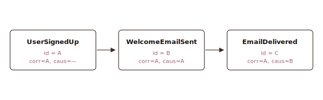
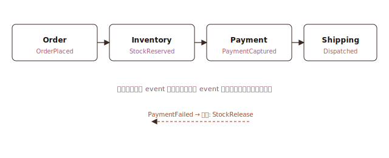
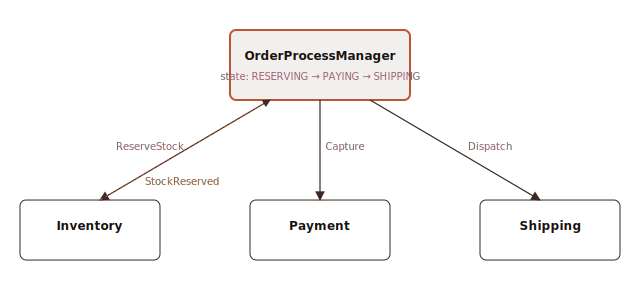
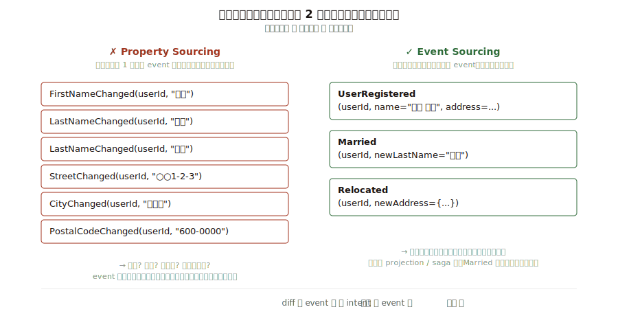

こんにちは、フリーランスエンジニアの太田雅昭です。

Event-driven / event sourcing 系の記事を最近 3 本読んで、それぞれ独立に効く話だったので個人メモとして 1 本にまとめておきます。

1. [`correlation_id` と `causation_id` — Arkency](https://blog.arkency.com/correlation-id-and-causation-id-in-evented-systems/)
2. [Saga と Process Manager — event-driven.io](https://event-driven.io/en/saga_process_manager_distributed_transactions/)
3. [Property sourcing anti-pattern — event-driven.io](https://event-driven.io/en/property-sourcing/)

---

# 1. `correlation_id` と `causation_id`

イベント駆動システムで「同じ会話」と「直接の因果」を追うための 2 つの ID の話。Greg Young が定式化した慣習で、Rails Event Store・EventStoreDB・NServiceBus などが標準メタデータとして採用しています。

## 定義

> If you are responding to a message, you copy its correlation id as your correlation id, its message id is your causation id.
> — Greg Young

event B が「A への応答」として発火するとき:

- `B.correlation_id = A.correlation_id`（無ければ `A.id`）
- `B.causation_id  = A.id`

root event (外部トリガー起因、親を持たないもの) は `correlation_id = self.id`, `causation_id = null` で始める。

## 2 つの違い

|  | correlation_id | causation_id |
|---|---|---|
| 意味 | 会話の識別子 | 直接の親を指すポインタ |
| 範囲 | 会話全体 (推移的) | 1 hop |
| 継承 | コピーして伝播 | 親の id を書き込む (毎 hop 変わる) |
| 用途 | 「この一連の流れで何が起きたか」 | 「これは何のせいで起きたか」 |

## シンプルな例

ユーザーがサインアップして、ウェルカムメールが送信され、それが配信される。event が 3 つ出るだけの直線 chain。



metadata を並べるとこう:

| event | id | correlation_id | causation_id |
|---|---|---|---|
| UserSignedUp     | `A` | `A` | `—` |
| WelcomeEmailSent | `B` | `A` | `A` |
| EmailDelivered   | `C` | `A` | `B` |

## これで何が引けるか

**この登録が引き起こしたことを全部見せて**

```sql
SELECT * FROM events WHERE correlation_id = 'A' ORDER BY seq;
-- → A, B, C 全部出る
```

**この配信の直接の原因は何?**

```sql
SELECT * FROM events WHERE id = (
  SELECT causation_id FROM events WHERE id = 'C'
);
-- → B (WelcomeEmailSent) が出る
```

**根まで遡って**

```sql
WITH RECURSIVE up AS (
  SELECT * FROM events WHERE id = 'C'
  UNION ALL
  SELECT e.* FROM events e JOIN up ON e.id = up.causation_id
)
SELECT * FROM up;
-- → C → B → A の順に出る
```

## なぜ 2 つ必要か

片方だけでは足りない。

- **correlation だけ** だと、会話全体は取れるが「どれがどれの子か」が分からない。順序が入り乱れるとツリーが復元できない。
- **causation だけ** だと、1 hop ずつ辿らないと会話全体を出せない。ツリーが深いとクエリが重くなり、途中で切れると先が見えない。

両方あると、**会話の範囲は等値検索で切り出せて、その中で親子関係も自明**。片方で他方を復元しようとしない。

## 実装で外しやすいところ

- **metadata に入れる、payload には入れない**。業務データと追跡のためのハウスキーピングは分ける。
- **publish 経路の 1 箇所で継承する**。handler の実装者が毎回書くと必ず抜ける。`AsyncLocalStorage` 等で「今処理中の親 event」を context に積んで、publish 側で自動 copy。
- **root event は correlation を自分の id にする**。null にすると projection の「会話でグルーピング」が壊れる。
- **request_id / trace_id を流用しない**。寿命も ID 空間も違う。OpenTelemetry の trace_id は短命、correlation_id は event log と同じだけ生き続ける。並存させる。

---

# 2. Saga と Process Manager

マイクロサービスや event-driven system で「複数サービスに跨る 1 つのビジネス処理をどう整合させるか」の話。2PC (2-phase commit) を諦めた世界での代替案として、この 2 つが並んで語られます。

## 何を解いているのか

単一 DB のトランザクションなら `BEGIN … COMMIT/ROLLBACK` で済む。問題は 1 つの業務処理が複数サービス (=別 DB) を跨いだ瞬間から始まる。例えば注文:

1. 在庫を押さえる (Inventory サービス)
2. 決済を authorize する (Payment サービス)
3. 発送を予約する (Shipping サービス)

3 のあと途中で失敗したら、1 と 2 も無かったことにしたい。しかし別 DB なので RDB のロールバックは効かない。

### なぜ 2PC じゃ駄目なのか

従来解の 2PC (X/Open XA・MSDTC など) は、全参加サービスが最後まで生きていて、全員が prepare を返せる前提。マイクロサービス・SaaS 統合・非同期メッセージング下だと:

- 全員に同時に in-flight のロックを掛けるので可用性がガタ落ち
- コーディネータが SPOF
- 途中で参加者が落ちるとロックが延々残る
- そもそも外部 SaaS は XA に参加してくれない

結論として「短命な原子性は諦めて、業務上の **eventually consistent** で受ける」方針が主流になった。その実装が Saga と Process Manager。

## Saga の起源

> A LLT is a saga if it can be written as a sequence of transactions T₁, T₂, …, Tₙ that can be interleaved with other transactions.
> — Hector Garcia-Molina & Kenneth Salem, *Sagas*, SIGMOD 1987

原典は 1987 年の SIGMOD 論文。想定は **長時間トランザクション (LLT, Long-Lived Transaction)** を単一 DB でどう扱うか、というかなり狭い問題設定だった。核となる 2 つのアイデア:

1. 大きな処理を、独立に commit できる小さいローカル tx T₁…Tₙ に分解する
2. 各 Tᵢ には **補償 tx (compensating transaction) Cᵢ** を定義しておく。途中で失敗したら、既に commit した T₁…Tₖ を Cₖ…C₁ の順で打ち消す

「取り消し」ではなく「打ち消す業務行為を後から流す」。予約を「解除する」、決済を「返金する」、在庫を「戻す」。この考え方が 2010 年代のマイクロサービス文脈に転用された (Chris Richardson の *Microservices Patterns* (Manning, 2018) が普及を主導)。

## Saga と Process Manager の違い

ここが最大の混乱ポイント。**流派で言葉の切り方が違う** ので、どっちの定義で話しているかを合わせないと議論が噛み合わない。

### Oskar Dudycz 流 (この記事の定義)

|  | Saga | Process Manager |
|---|---|---|
| 状態 | ステートレス | ステートフル (state machine) |
| 判断材料 | 受け取った event の内容のみ | event + 自身の内部状態 |
| 実装 | event → command の単純マッピング | 現在状態を保持し、遷移を管理 |
| 複雑さ | 低い | 高い |

Oskar の主張: **可能な限り stateless の Saga で済ませろ**。Process Manager は状態を持つ分、永続化・並行制御・リハイドレートの複雑さを引き受けることになる。

### Chris Richardson 流 (microservices.io / Manning 本)

こちらは「Saga」を上位カテゴリとして使い、実装スタイルで 2 分する:

|  | Choreography | Orchestration |
|---|---|---|
| 調整者 | いない (各サービスが自律) | 中央の orchestrator (= Process Manager) |
| 流れ | event を購読し反応 → 次の event を発火 | orchestrator が command を順に発射 |
| 可視性 | 低い (フローが分散) | 高い (1 箇所にある) |
| 結合度 | 低い | orchestrator への集中 |

Richardson 流では **Process Manager = Orchestration Saga の実装形**。Oskar 流の Saga (stateless) は Choreography 側に、Oskar 流の Process Manager は Orchestration 側にほぼ対応する。「Saga vs Process Manager」と「Choreography vs Orchestration」を混同しないこと。

## Choreography (Saga) の図



失敗時は逆向きに補償 event が流れる (点線)。

## Orchestration (Process Manager) の図



中央 PM が状態を持ち、次にどの command を出すか決める。返信は event で受ける。

## 補償 (compensating transaction)

saga の核。ロールバックが効かないので、意味論的に打ち消す。

| 正 tx | 補償 tx |
|---|---|
| StockReserved   | StockReleased |
| PaymentCaptured | PaymentRefunded |
| Dispatched      | ShipmentRecalled (or: そもそも Dispatch 前で止めるべき) |
| EmailSent       | ApologyEmailSent (メールは物理的に取り消せない) |

気を付ける性質:

- **べき等 (idempotent)**: 補償を 2 回流しても壊れないこと。at-least-once 配送前提だと必ず必要。
- **可換 (commutative) が理想**: 補償と後続の正 tx の順序が入れ替わっても結論が同じ。
- **意味論的取り消し**: 「決済を無かったことに」はできないが「返金する」ことはできる。監査ログには両方残る。
- **取り消せない副作用** (メール送信・物理配送・SNS 投稿) は、そもそも **後戻り可能な段階を過ぎる前に止める** 設計にする。

## ACID との違い

|  | ACID (単一 DB) | Saga |
|---|---|---|
| Atomicity  | あり | ない。ステップ単位に緩和 |
| Consistency| 強整合 | eventually consistent |
| Isolation  | あり | **ない**。途中状態が他 tx に見える |
| Durability | あり | あり (各ステップは commit 済み) |

Isolation が無いのが最大の性質差。**「まだ確定していない中間状態が外から見える」** ため、UI 表記 (「保留中」「処理中」)、二重予約防止、読み側の semantic lock などで補う。ここを設計しないと saga は破綻する。

## 使い分け

**Choreography (Saga) を選ぶとき**

- ステップが少ない (3〜4)
- 分岐がほぼない、あっても失敗 → 補償の 1 択
- 各サービスが疎結合を維持したい
- フローが安定していて全体像を頻繁に見直さない

**Orchestration (Process Manager) を選ぶとき**

- ステップが多い、分岐が複雑
- 複数 event を待ち合わせる (fan-in、AND join)
- タイムアウトを明示的に扱いたい
- フロー全体を 1 箇所で見たい・変更したい
- 非開発者 (BPMN で会話するような業務側) と共有したい

## アンチパターン

- **2PC を saga で真似しようとする**: 全ステップを予約→確定の 2 段構えにして原子性を回復しようとする。可用性が落ちて 2PC より悪化する。
- **補償を用意しないで先に進む**: 「失敗しないと信じる」実装。デモは動くが本番で必ず崩れる。
- **orchestrator に業務判断を全部集める**: process manager が「注文の意味」まで知りすぎる god object になる。orchestrator は **「どの順で誰を呼ぶか」だけ** を知る。金額計算・在庫判定は各サービスに残す。
- **event に副作用を混ぜる**: event handler の中で外部 API を叩いて、結果を event に混ぜて publish。at-least-once 下で二重呼び出しになる。**command → 副作用 → event 発火** の順を守る。
- **choreography で分岐を増やしすぎる**: 気づくと 12 サービスが互いの event を購読して、全体フローを誰も追えなくなる。分岐が増えたら orchestration に切り替える。

---

# 3. Property Sourcing はアンチパターン

「フィールドが 1 個変わるたびに 1 event を出す」という設計は、event sourcing のように見えて、実質は event 型でラップされた CRUD になっている、という話。

> Publishing events like *LastNameChanged* is called *Property Sourcing*. This is an anti-pattern.
> — Oskar Dudycz

## 悪い例 vs 良い例



### ✗ Property Sourcing

```
FirstNameChanged(userId, "太郎")
LastNameChanged(userId, "山田")
StreetChanged(userId, "○○1-2-3")
CityChanged(userId, "京都市")
PostalCodeChanged(userId, "600-0000")
```

これを読んでも「**何が起きたのか**」が分からない。名前が変わったのは結婚? 改名? タイポ修正? 引越し? 全部同じ event 列に見える。event に **業務的意味** が乗っていない。

### ✓ Event Sourcing

```
UserRegistered(userId, name, address, ...)   // 会員登録
Married(userId, newLastName="鈴木")          // 結婚
Relocated(userId, newAddress={...})         // 引越し
```

こちらは **業務上の出来事** を記録している。「結婚したから姓が変わった」「引越したから住所が全部変わった」という文脈が event 自体に載っている。

## 何がダメか

1. **業務的意味が消える** — 「なぜこの変更が起きたか」の情報がゼロ。監査ログとしても価値が低い。「LastName が変わった」ではなく「結婚した」を残したい。
2. **event 型が爆発する** — フィールド数 × 変更パターンだけ event クラスが要る。100 フィールドあるドメインなら *Changed イベントが 100 個。管理不能。
3. **消費側 (subscriber) が意味を組み立てられない** — projection や saga は「何が起きたか」で分岐したい。property sourcing だと **event を集めて "つまり何が起きたのか" を推測する後処理** が必要になる。それをやるくらいなら CRUD で十分。

## なぜ皆この罠にはまるか

Oskar が指摘してるのは:

> When we learn a new pattern, we subconsciously try to translate our previous habits into it.

RDB 出身者は「テーブルの各カラムに UPDATE 文が飛ぶ」感覚を event に持ち込みがち。1 UPDATE = 1 event と考えると、必然的に property sourcing になる。

マインドセットの転換:

|  | 記録するもの |
|---|---|
| CRUD 脳 | 今、何が変わったか (= diff) |
| ES 脳  | 今、業務上何が起きたか (= 事実 / intent) |

diff は event の **結果** であって、event の **中身** ではない。

## 例外: フィールド粒度でも意味を持つ場合

Oskar も「常にダメ」とは言っていない。**変更自体が業務イベント** な場合はフィールド単位で切っていい。

| フィールド | event として意味あり? | 理由 |
|---|---|---|
| `Email`         | ✓ | 認証・通知に直結する重要変更 |
| `InvoiceNumber` | ✓ | 法的・監査要件で単独の意味あり |
| `MaritalStatus` | ✓ | 下流の業務ワークフローを起動する |
| `FirstName`     | ✗ | 単独では意味薄。通常「結婚」「改名」の一部 |

## 判断基準

> If our events are only about the fields updates … we should evaluate if simple CRUD wouldn't be better for us.

意訳: **event が「フィールド更新の告知」以上のことを言えないなら、それは event sourcing じゃなくて CRUD。素直に CRUD にしろ。**

全部を event source にする必要はない。「本当に業務イベントとして残す価値のあるもの」だけを event 化する。プロファイル情報のような CRUD で足りるものは CRUD で持つ。

---

# 3 本を通して見えたこと

3 つは別々の話ですが、根っこは 1 つで:

**event に業務的意味があって初めて、周辺パターン (correlation / saga / projection) が全部働く。**

- correlation/causation ID は event を追跡するための道具。event に意味がなければ (property sourcing) 追跡しても情報が出ない。
- Saga は event を購読して次の業務行為を決める。event が `LastNameChanged` しか来なければ「何をすればいいか」を決められない。`Married` が来れば「配偶者控除の再計算」「保険受取人確認」等のフローに繋げられる。
- どちらも **「event の粒度 = 業務の粒度」** に合わせて設計されている前提で成り立つ。

event sourcing を採用する意味は「業務の出来事を fact として log に残し、そこから何度でも状態と副作用を再構成できる」ところにあって、property sourcing はその意味を消してしまう。3 本まとめて読むと、event の粒度を業務側で決めることがいかに全体の設計を左右するかがよく見えました。
