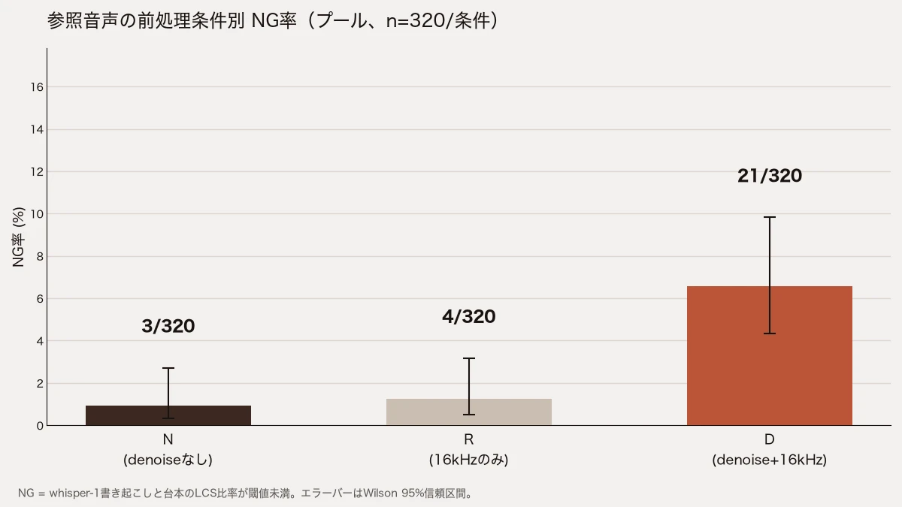
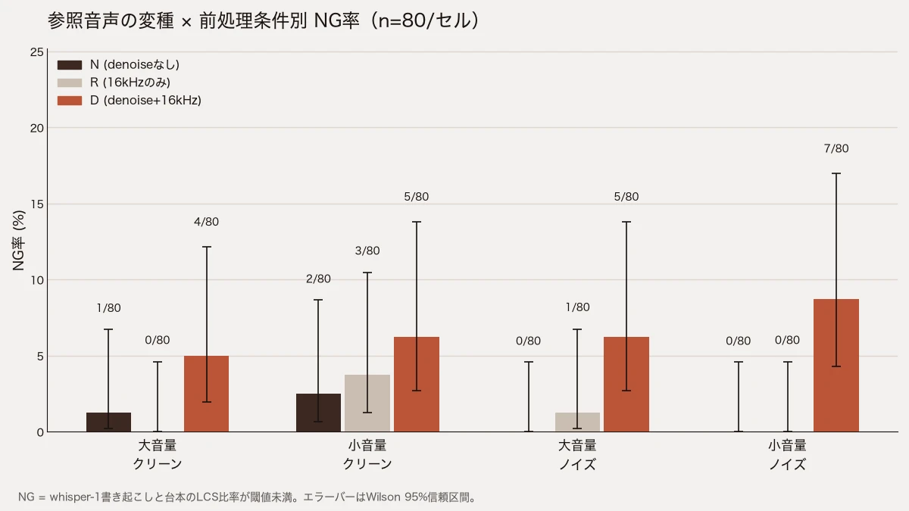

こんにちは、フリーランスエンジニアの太田雅昭です。この記事はほとんどAIが書いたものを、私が加筆修正しています。検証不十分な部分もあるかと思いますが、ご容赦ください。ご指摘等ございましたら、Github issueか、Xでお願いいたします。

zero-shot voice clone の TTS を実運用で回すと、参照音声 (reference audio) の前処理をどこまでやるかという判断が出てきます。そのひとつが denoise です。ノイズが乗った参照音声はきれいにしてから渡したほうがいい、という直感は自然で、私のパイプラインにも別の TTS エンジン向けに入れた denoise が残っていました。ところが、静かな参照音声に denoise が発動した回で、台本と無関係な音声が出る事例に当たりました。denoise のせいなのか、単に静かな参照音声が悪かっただけなのかは切り分けられません。そこで denoise の有無だけを変数にした A/B を 960 本走らせました。

## 結論

- denoise をかけると NG 率は 3/320 (0.9%) から 21/320 (6.6%) に上がった。Fisher の正確検定 (両側) で p<0.001
- 悪化は denoise 本体によるもので、同時に行われる 16kHz mono 化の影響ではない。16kHz mono 化だけの対照条件は 4/320 (1.3%) で、denoise なしとの差は p=1.000
- 変種別ではノイズありかつ小音量が最悪 (0/80 → 7/80、p=0.014)。denoise が効きそうな条件ほど悪化しており、直感と逆向き
- 崩壊 (LCS 比率 0.5 未満) は 2/320 → 9/320 で p=0.063、尺超過は 5/320 → 5/320 で差なし。どちらも有意ではない
- 以前の Qwen3-TTS では同じ denoise でノイズ起因の失敗が 10 本中 3 本から 0 本に減っており (n=10)、エンジンによって向きが逆
- 発動ゲート (SNR 30dB 未満かつ max_volume が -15dB 以上) は loudnorm しただけのクリーンな素材でも成立した (女性話者は SNR 23.1dB)

## 背景

Fish Audio の zero-shot voice clone については、[毎回同じ声が出るのか](/blog/posts/2026/08-26-aifish-audioのzero-shot-voice-cloneは毎回同じ声が出るのか話者embeddingで測定/)と[参照音声の発話密度で品質が決まる](/blog/posts/2026/08-26-aitts参照音声の密度で品質が決まる話mean_volumeとzero-shot-voice-clone/)の 2 本を書きました。後者は「無音が多い参照音声はモデルを狂わせる」という話で、対策は silenceremove と loudnorm です。denoise は別系統の前処理で、導入の動機は以前使っていた Qwen3-TTS (self-host) での評価です。そのときは逆の結果で、SNR 20dB 程度の pink noise を足した参照音声で生成が止まらず上限まで走る失敗 (EOS 不発) が 10 本中 3 本出たのに対し、DeepFilterNet 3 で denoise した参照音声では 10 本中 0 本になりました。n=10 なので統計的に確定した差ではありませんが、方向として denoise は有効に見えていました。エンジンを Fish Audio に載せ替えたあとも、この前処理だけがそのまま残っていた、という位置づけです。

## 実験設計

変数は参照音声への denoise の有無だけです。切り出し区間・無音圧縮・末尾の pad・モデル・temperature・台本・参照音声側の書き起こしを渡さないことは、全条件で同一にしました。

| 条件 | 内容 |
|------|------|
| N | denoise なし |
| D | DeepFilterNet 3 で denoise してから 16kHz mono 化 |
| R | 16kHz mono 化のみ |

D が 2 変更を同時に含むのは、私のパイプラインの denoise 経路が fal.ai 経由の DeepFilterNet 3 を通したあと 16kHz mono で返すためです。D だけでは差を denoise 本体に帰属できないので、16kHz mono 化だけの R を対照に置きました。

参照音声は公開コーパス JVNV の女性話者 F1・男性話者 M1 の 2 名です。話者ごとに、loudnorm しただけの大音量クリーン、それを 10dB 減衰した小音量クリーン、それぞれに pink noise を SNR 20dB 目安で足した大音量ノイズ・小音量ノイズ、の 4 変種を作りました。台本は短文 (2 行 19 文字) と長文 (22 行 244 文字) の 2 種で、1 行 1 発話として改行区切りのまま渡します。

セルは参照音声 8 種 × 台本 2 種 × 条件 3 種の 48 セル、各セル n=20 で合計 960 本です。実行順は rep ごとに N → D → R を回して、時間帯のドリフトが条件に偏らないようにしました。エラーは 0 件です。

判定基準は走らせる前に固定しました。生成音声を whisper-1 で書き起こし、台本との LCS (最長共通部分列) 比率が閾値未満なら NG、0.5 未満なら崩壊、実測尺が保守的な話速からの見積もり上限を超えたら尺超過です。主判定は pooled の NG 率を N と D で Fisher の正確検定 (両側、α=0.05) にかけることとしました。

## 前処理チェーン

参照音声の作り方は実運用のものをそのまま写しています。

1. 先頭 15 秒に切り出す
2. 条件に応じて denoise (D) / 16kHz mono 化 (R) / 何もしない (N)
3. silenceremove と loudnorm で無音を詰めて音量を揃える (全条件共通)
4. 末尾に 0.5 秒の無音を足す

生成は `s2.1-pro`、出力は wav、temperature と top_p はどちらも 0.7 です。参照音声側の書き起こしは渡していません (有無で声が変わらないことは前々回に測ってあります)。denoise の発動可否は本番相当のゲートで記録だけ取り、実験では全参照音声に 3 条件を強制適用しました。ゲートに任せると参照音声ごとに条件が変わって比較にならないためです。

## 結果

| 条件 | NG | 崩壊 | 尺超過 |
|------|-----|------|--------|
| N (denoise なし) | 3/320 | 2/320 | 5/320 |
| R (16kHz mono 化のみ) | 4/320 | 2/320 | 0/320 |
| D (denoise + 16kHz mono 化) | 21/320 | 9/320 | 5/320 |

NG 率は N と D で p<0.001、N と R で p=1.000、R と D で p=0.001 でした。denoise をかけた条件だけが悪く、16kHz mono 化は無害です。

崩壊は 2/320 対 9/320 で p=0.063、尺超過は両方 5/320 で p=1.000 と、どちらも有意ではありません。denoise が押し上げたのは、読みが台本から外れて LCS 比率が閾値を割る程度の失敗が中心でした。

台本別でも方向は同じで、短文は N 1/160 に対して D 10/160 (p=0.010)、長文は N 2/160 に対して D 11/160 (p=0.020) です。

変種別 (話者 2 名と台本 2 種を合わせて n=80/セル) では悪化が偏りました。

| 変種 | N | R | D | N vs D の p |
|------|---|---|---|-------------|
| 大音量クリーン | 1/80 | 0/80 | 4/80 | 0.367 |
| 小音量クリーン | 2/80 | 3/80 | 5/80 | 0.443 |
| 大音量ノイズ | 0/80 | 1/80 | 5/80 | 0.059 |
| 小音量ノイズ | 0/80 | 0/80 | 7/80 | 0.014 |

有意になったのは小音量ノイズだけで、大音量ノイズが続きます (p=0.059)。クリーンな 2 変種は D が悪い向きではあるものの有意ではありません。denoise が最も役に立ちそうなノイズあり条件で、denoise なしの NG が 0 のところに 5 件・7 件の NG が出ています。

話者別では女性話者 F1 が N 1/160 に対して D 12/160 (p=0.003)、男性話者 M1 が N 2/160 に対して D 9/160 (p=0.061) です。どちらも D が悪い向きですが有意なのは F1 だけで、話者 2 名なので一般化はしません。

NG の実物を挙げます。短文の台本は「おはようございます。/今日は晴れですね。」です。

- 女性話者・大音量ノイズ・短文・D、LCS 比率 0.059、実測 13.4 秒 (上限 11.4 秒)。書き起こしは「ふぅ、わんたんとなにのかん、たんとまもとにんこ、くまさんかんかんたん、かんとくま、にゃん。」
- 男性話者・大音量ノイズ・短文・D、LCS 比率 0.000、実測 3.1 秒。書き起こしは「ニャンティア、ワイアフタンギャチョウム。」
- 女性話者・小音量ノイズ・長文・D、LCS 比率 0.041、実測 132.8 秒 (上限 89.7 秒)。書き起こしは「チャンネル登録をお願いいたします。」

3 件目のような定型句へ滑り落ちる出方は denoise なし側にも 1 件出ています (女性話者・小音量クリーン・長文・N、LCS 比率 0.041、書き起こしは「最後までご視聴いただき、ありがとうございました。」)。この故障モードは denoise 固有ではなく、denoise は頻度を押し上げていると読めます。

## 考察

16kHz mono 化だけの R は denoise なしと区別がつかず (3/320 対 4/320、p=1.000)、R と D の比較では p=0.001 が出ています。悪化は 16kHz mono 化ではなく DeepFilterNet 3 の処理そのものに帰属できます。

ノイズがある条件ほど悪化が大きいのは予想外でした。SNR 20dB 程度の pink noise が乗った参照音声で、denoise なしの NG は 0/80 なのに、denoise をかけると 5/80・7/80 になります。denoise が削っているのはノイズだけではなく、声の成分の一部も一緒ではないかと考えています。zero-shot voice clone は参照音声の細部 (子音の立ち上がり、息、部屋の響き) から話者の特徴を組み立てているはずで、そこが削られると参照音声は「きれいだが情報の薄い音声」になります。前回の発話密度の話と方向は同じです。あくまで仮説で、embedding での直接検証はしていません。

発動ゲートについても記録が取れました。SNR 30dB 未満かつ max_volume が -15dB 以上という条件は、女性話者では 4 変種すべてが成立します。loudnorm しただけのクリーンな素材でも SNR は 23.1dB です。男性話者はクリーンな 2 変種が 34.1dB で非発動、ノイズを足した 2 変種だけが発動しました。普通の録音でも発動する側に倒れるので、SNR ベースのゲートで適用範囲を絞る設計は思ったほど効きません。

Qwen3-TTS で見えた「denoise が効く」方向が Fish Audio では反転した点は、エンジンごとに参照音声の使い方が違うことを示しています。Qwen3-TTS の失敗はノイズにつられて EOS を出せなくなる型で、ノイズを消せば止まるようになります。Fish Audio の失敗は読みが台本から外れる型で、denoise で声の細部が削られると悪化します。前処理はエンジンをまたいで持ち越さず、載せ替えのたびに測り直す必要があります。

効果の大きさも押さえておきます。約 1% から約 7% なので、5 倍に増えてなお 93% は通ります。事前に手元で回した小規模テスト (n=10) で見た「10 本中 7 本が破綻」という水準は再現しませんでした。denoise は破綻率を押し上げる要因のひとつではあっても、それ単独で事故を説明しきれてはいません。参照音声の発話密度・収録環境・実際のノイズの質との組み合わせが残っている可能性があります。

## 限界

- 参照音声は感情演技コーパスの sad (悲しみ) 発話です。JVNV に平静カテゴリがないため最も低覚醒な感情を選びました。平静な朗読音声では結果が変わりえます
- ノイズは pink noise の人工付加で、エアコンや残響など実環境のノイズとは性質が違います。話者 2 名・日本語のみ・`s2.1-pro` のみ・temperature 0.7 固定で、denoise も DeepFilterNet 3 の 1 種類だけです
- NG 判定は whisper-1 に依存するため ASR 側の誤りも混ざります。ただし 3 条件で同じ ASR を使っているので、条件間比較への影響は小さいはずです

## 実務での扱い

Fish Audio の zero-shot voice clone に渡す参照音声には denoise をかけない、という判断にして、前処理を外すことにしました。この実験の範囲では、denoise が品質を上げる条件は見つかっていません。ノイズが気になる参照音声は前処理では解けず、録音し直すかノイズの少ないテイクを選ぶ話になります。発話密度の底上げは効果が確認できているので残します。

## 再現手順

ハーネスは [blog-examples](https://github.com/mohhh-ok/blog-examples/tree/main/2026/09-13-fish-ref-denoise-ab) に置いてあります。変種生成から前処理・生成・書き起こし・検定まで自己完結しているので、`FISH_API_KEY` / `OPENAI_API_KEY` / `FAL_KEY` を設定し、話者 wav と台本ファイルを用意すれば同じ手順を回せます。

参照音声には JVNV コーパス (CC BY-SA 4.0) を使いました。

> Detai Xin, Junfeng Jiang, Shinnosuke Takamichi, Yuki Saito, Akiko Aizawa, Hiroshi Saruwatari, "JVNV: A Corpus of Japanese Emotional Speech with Verbal Content and Nonverbal Expressions," arXiv preprint 2310.06072, Oct. 2023.

各発話には「あーあ」のような非言語発話の区間が付属ラベルで示されているので、ffmpeg の atrim と concat で切り落としてから 2 発話を連結し、話者あたり 18 秒程度の原本にしました。参照音声そのものと生成音声は公開しません。ライセンス上は再配布できますが、今回は数値と図だけを公開する運用にしています。

## 参考

- [ハーネス一式 (blog-examples)](https://github.com/mohhh-ok/blog-examples/tree/main/2026/09-13-fish-ref-denoise-ab)
- [Fish Audioのzero-shot voice cloneは毎回同じ声が出るのか](/blog/posts/2026/08-26-aifish-audioのzero-shot-voice-cloneは毎回同じ声が出るのか話者embeddingで測定/)
- [TTS参照音声の密度で品質が決まる話](/blog/posts/2026/08-26-aitts参照音声の密度で品質が決まる話mean_volumeとzero-shot-voice-clone/)
