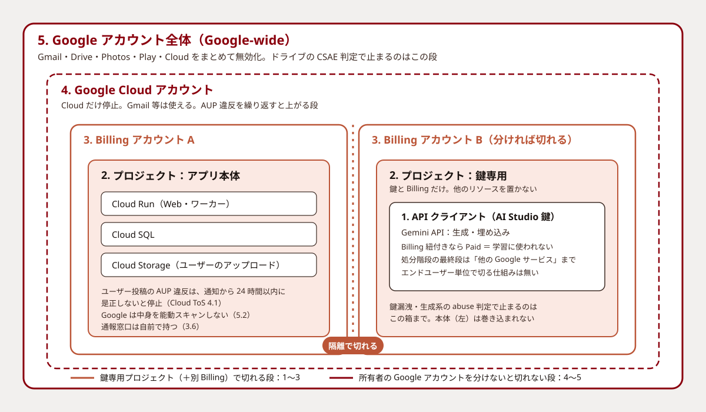

こんにちは、フリーランスエンジニアのmohです。この記事はほとんどAIが書いたものを、私が加筆修正しています。検証不十分な部分もあるかと思いますが、ご容赦ください。ご指摘等ございましたら、Github issueか、Xでお願いいたします。

## 背景

Geminiを使用してアカウントごとBANされた話や、Googleドライブにダメな画像をアップロードしてBANされた話を見つけました。

GeminiでチャHしてたらアカウントBANされた\
https://anond.hatelabo.jp/20251211104855

マンガ原稿をクラウドに上げただけでGoogleアカウントBAN　Gmailも道連れ……日本では合法なのになぜ？\
https://www.itmedia.co.jp/news/article/2609/16/2000001527/

誰にとっても他人ごとではなく、機械検出の誤検知や、サービス提供者なら利用者側の粗相で同じ目に遭う可能性があります。

サービス提供者側の視点で、今回AIに調査してもらいました。

## 先に結論

自分のサービスが Gemini を呼んでいて、ユーザーの入力をそのまま流しているなら、心配は当たっています。ただ、怖がるべき場所と、手を打てば済む場所は分かれています。

- 止まる引き金で一番多いのは、ユーザーの粗相ではなく API キーの漏洩です。約 2 ドルの不正利用で本番プロジェクトが止まった例があります
- 止まる範囲は 5 段階あり、Gemini の呼び出しを別プロジェクトに隔離すると 3 段目までは本体を守れます。残り 2 段 (Google Cloud アカウント、Google アカウント全体) は、所有者を分けない限り一緒に止まります
- ユーザーの違反をそのユーザーだけで切る仕組みは Gemini にありません。流す前に自分でフィルタするしかありません
- Cloud Storage に上げられた画像を Google が勝手にスキャンして止める、という条文はありません。代わりに、通報を受けたら 24 時間以内に消す義務が自分にあります

以下、「うちはどこまで危ないのか」を順に見ていきます。根拠は Google の規約と公式ドキュメントの原文で、要点だけ引用します。

## まず、実際に何が起きて止まっているのか

規約の前に、実例を見たほうが早いです。当事者の投稿や報道の実ページで確認できた 11 件を、引き金ごとに並べます。

| 引き金 | 何が止まったか | 戻ったか |
|--------|---------------|---------|
| API キーが数時間だけ公開バンドルに露出、1 日 1,900 ドル超の不正利用 ([投稿](https://discuss.ai.google.dev/t/appeal-gcp-project-bibi-3817-suspended-after-api-key-abuse-apr-30-may-1-2026/143360)) | プロジェクト。同居していた Maps と OAuth も一緒に停止 | 未解決 |
| 第三者による約 2 ドルの不正呼び出し ([投稿](https://discuss.ai.google.dev/t/production-project-suspended-for-hijacked-resources-after-gemini-api-key-abuse-appeal-filed-business-fully-down-remediation-technically-impossible-what-can-i-do/175636)) | プロジェクト。同居の Firestore・Auth・Storage も停止し、有料サービスが全停止 | 未解決 |
| AI Studio のプロジェクトに自動フラグ ([投稿](https://discuss.ai.google.dev/t/urgent-account-locked-out-after-automated-ai-studio-project-suspension-gcp-case-72102431/171417)) | プロジェクトから GCP コンソール全体へ | 未解決 |
| サードパーティのコーディングツール経由で高頻度に呼び出し ([GitHub](https://github.com/RooCodeInc/Roo-Code/issues/11922)) | GCP アカウント全体 | 記載なし |
| サードパーティツール経由の利用 ([投稿](https://discuss.ai.google.dev/t/appeal-antigravity-gemini-access-disabled-403-tos-violation/172323)) | アカウント単位の 403 | 未解決 |
| Google 推奨の方式で Cloud DNS を使っていた証明書サービス ([HN](https://news.ycombinator.com/item?id=45798827)) | GCP アカウント全体を 3 回 | 3 回とも戻ったが理由の説明なし |
| 無料枠で複数プロジェクトを使い、クォータ回避と誤検知 ([HN](https://news.ycombinator.com/item?id=46839375)) | GCP アカウント全体 | HN で話題になった当日に戻り、Google が謝罪 |
| 請求失敗。サポートに「止めない」と言われた後に停止 ([HN](https://news.ycombinator.com/item?id=32547912)) | Billing アカウント。本番が全停止 | 不明 |
| 医師向けに撮った幼児の患部写真がフォトの自動バックアップで CSAM 判定 ([報道](https://www.thedailybeast.com/google-brought-cops-down-on-california-dad-who-took-medical-pics-of-his-naked-toddler-report-says/)、[EFF](https://www.eff.org/deeplinks/2022/08/googles-scans-private-photos-led-false-accusations-child-abuse)) | Google アカウント全体 (Gmail、電話番号まで) | 警察は犯罪なしと結論したが戻らず |
| 元従業員の別アカウントの Ban に「関連している」と判定 ([HN](https://news.ycombinator.com/item?id=30855065)) | 会社の Play Developer アカウント | 戻らず |
| 過去作の漫画原稿をドライブにアップロード ([ITmedia](https://www.itmedia.co.jp/news/article/2609/16/2000001527/)) | Google アカウント全体 | 再審査却下 |

ここから読めることは 3 つです。

1. Gemini がらみの停止は、鍵単位では来ていません。全部プロジェクトかアカウント単位です。「鍵を無効化されるだけ」と思っていると、同じプロジェクトの無関係なサービスまで止まります
2. 引き金で多いのはユーザーの粗相より、鍵の漏洩と第三者の不正利用です。金額は関係なく、2 ドルでも止まっています
3. Google アカウント全体が止まった例は、戻った例がありません。戻ったのは GCP アカウント単位の 2 件で、片方は SNS で話題になった当日でした

## 止まったら、どこまで巻き込まれるのか

Google Cloud の[プロジェクト停止ガイドライン](https://cloud.google.com/resource-manager/docs/project-suspension-guidelines)が、停止の単位を 5 段階で書き分けています。自分のサービスに当てはめると、こう読めます。

1. API クライアント。その鍵が使えなくなる
2. プロジェクト。そのプロジェクトの Cloud Run も Cloud SQL も一緒に止まる。原文は "all the associated Google Cloud workloads will be suspended as well"
3. Billing アカウント。その Billing に紐付く全プロジェクトが止まる
4. Google Cloud アカウント。Cloud 全部が止まるが、Gmail などは使える。原文に "They will continue to have access to other Google services like Gmail" とある
5. Google アカウント全体。Gmail もドライブも Cloud も止まる。冒頭の報道はここ

Gemini API (AI Studio の鍵) は、この Cloud の規約とは別の体系にいます。[Gemini API の追加規約](https://ai.google.dev/gemini-api/terms)自身が "these Terms do not govern your direct use of any Google Cloud Platform service" と書いています。そして Gemini API 側の[処分階段](https://ai.google.dev/gemini-api/docs/usage-policies)の最終段はこうです。

> Account closure: As a last resort, and for serious violations, we may permanently close your access to the Gemini API and other Google services.

「other Google services」まで及ぶ書き方で、鍵やプロジェクトで止まる保証はありません。一般の [Google 利用規約](https://policies.google.com/terms)には、追加規約やポリシーの重大な違反で Google アカウントを削除し得る条項もあります。

## 隔離すれば助かるのか

Gemini の呼び出しだけを、鍵と Billing しか置かない別プロジェクトに移す案です。上の 5 段階に当てはめると、効くのは 3 段目までです。

- 鍵の漏洩や生成系の abuse 判定でプロジェクトが止まる、という一番多いパターンからは本体を守れます。実例で同居サービスが巻き添えになっていたのは、まさにここです
- Billing も分ければ 3 段目まで切れます
- 4 段目と 5 段目は、隔離先が同じ Google アカウント (組織) の下にある限り一緒に止まります。実例にも、プロジェクト起点で GCP アカウント全体まで上がった件があります

所有者まで分ければ安全かというと、それも保証がありません。元従業員の別アカウントの Ban に「関連している」と判定されて会社ごと止められた例があり、関連アカウントを独立と見なす条文は見つかりませんでした。「別の Google アカウントと別の支払い手段を用意するか」は、技術ではなく体制の話になります。

## ユーザーの粗相を、そのユーザーだけで切れないのか

OpenAI には safety_identifier というパラメータがあり、エンドユーザーを識別して、違反があればそのユーザーだけを止め、開発者の組織全体への影響を減らすと公式に書かれています。同じものが Gemini にあれば話は楽です。

ありませんでした。Gemini API の [generateContent](https://ai.google.dev/api/generate-content) と [embedContent](https://ai.google.dev/api/embeddings) のパラメータに相当するフィールドは無く、Vertex AI の labels も「key-value のメタデータ」とだけ定義されています。検知と処分の単位は project か customer 止まりです。

つまり、ユーザーの入力をそのまま流す用途 (文章の生成、翻訳、危ない表現の監査など) の違反は、全部あなたのプロジェクトの違反として積み上がります。Google APIs 規約には、エンドユーザーの違反について開発者が Google を補償する条項もあります (Section 9c)。流す前に自分でフィルタを置くしかありません。OpenAI の moderation endpoint のような無料の判定を前段に挟むのが現実的です。

なお「生成ではなくベクトル化 (embedding) だけなら大丈夫か」も見ましたが、規約の適用範囲は Gemini API 全体で、embedContent を除外する条文はありません。実例には embedding が引き金になったものは無く、生成系より検知に引っかかりにくい可能性はありますが、保証は無いです。

## Cloud Storage に上げられた画像はどうなるのか

冒頭の報道は「Google がドライブの中身をスキャンして本人のアカウントを止めた」話です。自分のサービスの Cloud Storage にユーザーが危ない画像を上げたら、同じことが起きるのか。

[Cloud の利用規約](https://cloud.google.com/terms)を読む限り、Google が Cloud Storage の中身を能動的にスキャンする条文はありません。5.2 で Customer Data の処理目的をサービス提供に限定していて、自動スキャンを明記しているのは生成 AI のプロンプトと出力についてだけです (4.3)。「スキャンしない」と約束する条文も無いので、確実とは言えませんが、ドライブとは仕組みが違います。

代わりに、3.6 で「第三者のコンテンツをホストする顧客」に義務が課されます。禁止コンテンツのポリシーを公開すること、通報を受ける窓口を持つこと、通報を審査して消すことの 3 つです。処分の流れは 4.1 で「Google が違反を知る → あなたに通知 → 24 時間以内に直さなければ停止」、法令案件は 4.2 で猶予なしの即時停止があり得ます。

要するに Cloud では、「Google に見つかる」より「誰かに通報されて、通知に 24 時間以内に応じられるか」が分かれ目です。公開 URL で配信しているコンテンツは第三者から Google に直接通報できます。通報窓口と削除の運用、それと Google からの通知が誰に届くかの確認は、隔離より先に要る話です。

## じゃあ何をすればいいのか

上から順に効きます。

1. 鍵を漏らさない。Secret Manager に置き、クライアントに出さない。実例の引き金で一番多いのはここで、隔離と同じくらい効きます
2. Gemini の呼び出しを鍵専用プロジェクトに隔離する。Billing も分ける。プロジェクト単位の停止から本体を守れます
3. ユーザーの入力を流す前に、自分でフィルタを置く。Gemini 側にユーザー単位で切る仕組みは無いです
4. サービスから Gemini を呼ぶときは公式 SDK か自前クライアントに限る。サードパーティツール経由が引き金になった例があります
5. ユーザー投稿をホストしているなら、ポリシー公開・通報窓口・削除の運用を整える。通知から 24 時間で止まります
6. Google からの通知が届くチャネルと、有料サポート契約を用意する。誤検知は説明なしで止まり、appeal より SNS で話題になったほうが早く戻った例があります
7. それでも Google アカウント全体の段は残る。そこまで切りたければ、別の Google アカウントと別の支払い手段の話になります

## おまけ: 学習に使われるのか

隔離で AI Studio の鍵に切り替えるなら、ついでに気になる点です。

- 有料枠 (Paid) では学習に使われません。原文は "Google doesn't use your prompts (...) or responses to improve our products"。ログは違反検知のためだけに一定期間残ります
- 有料かどうかは課金額ではなく、"a Cloud Project associated with an active billing account" 経由かどうかで決まります。Billing を付けていないローカル開発用のプロジェクトで鍵を作っていると、そこに流したものは学習と人間レビューの対象です
- Vertex AI にあった data residency の保証は、AI Studio 鍵の経路では付きません。適用される DPA が Cloud DPA ではなく汎用の Processor DPA になります
