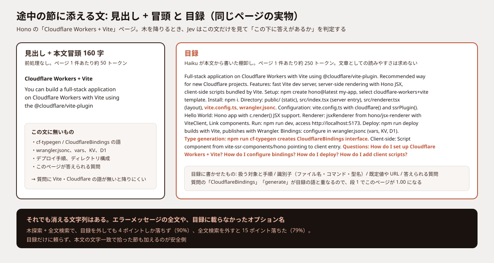
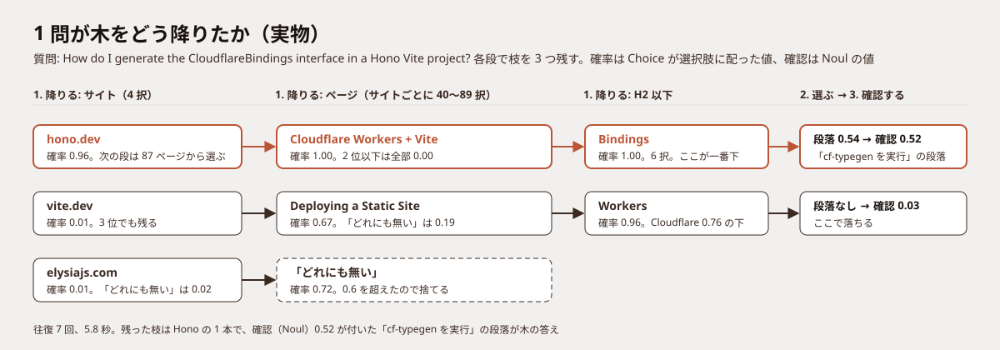
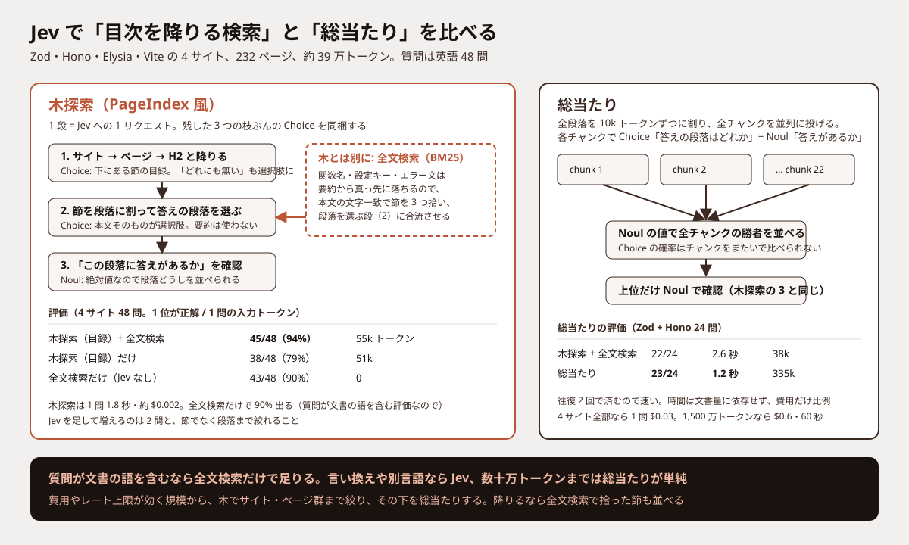

こんにちは、フリーランスエンジニアの太田雅昭です。この記事はほとんどAIが書いたものを、私が加筆修正しています。検証不十分な部分もあるかと思いますが、ご容赦ください。ご指摘等ございましたら、Github issueか、Xでお願いいたします。

ベクトル検索を使わず、LLM が目次を読みながら文書を降りていく PageIndex という検索手法があります。段ごとに LLM を呼ぶので遅いのが難点でしたが、[TypeSafe](https://typesafe.ai) の Jev は 1 回 0.2〜0.5 秒で「どれか」と「あるか」を返すので、この「降りる判断」を任せたら速くなるのではと思って試しました。コードと目録・評価セットは [blog-examples](https://github.com/mohhh-ok/blog-examples/tree/main/2026/09-18-pageindex-jev) に置いています。

## 結論

- 4 つのドキュメントサイト（Zod・Hono・Elysia・Vite、計 232 ページ）に対する 48 問で、Jev を使わない全文検索（BM25）だけで 43 問の正解を 1 位に出せました。Jev で目録を見ながら木を降りる木探索だけだと 38 問、両方を合わせると 45 問です
- この規模なら、木を降りずに全段落を Jev に並列で投げる総当たりが一番単純で、2 サイト 24 問では 23 問、1 問 1.2 秒、$0.014 でした。木探索と全文検索はどちらも 22 問です
- 全文検索は語の一致なので、質問が文書と同じ語を使うときにしか効きません。言い換えた質問や別の言語の質問で意味を見て探すには Jev が要ります。今回の評価の質問は文書の語をそのまま含む作りで、その差は測っていません
- LLM に書かせる目録の前処理は、手間のわりに効果が 2 問ぶんでした

## 実験の分け方

方式ごとに章を分けています。木探索と全文検索は同じ 48 問、総当たりは費用が文書量に比例するので Zod と Hono の 2 サイトに絞った 24 問です。

| 方式 | 何で探すか | Jev | 対象 |
|---|---|---|---|
| 木探索 | 目録を見て、Jev が木を根から降りる | 使う | 4 サイト 48 問 |
| 全文検索 | 本文の語の一致（BM25）で節を拾う | 使わない | 4 サイト 48 問 |
| 木探索 + 全文検索 | 両方で拾った節を並べ、Jev が段落を選ぶ | 使う | 4 サイト 48 問 |
| 総当たり | 全段落を分割して Jev に並列で投げる | 使う | 2 サイト 24 問 |

### 評価のしかた

各サイトから節を 12 個ずつ乱数で選び、「その節だけを読めば答えられる具体的な質問」をサブエージェントに書かせました。返した段落か節が正解の節の中にあれば当たりです。費用は Jev の単価 $0.042 / 100 万トークンで計算し、出力トークンは無料です。

## 木探索

### PageIndex の仕組み

PageIndex は文書を目次の木にしておき、質問が来たら LLM が「この節の下に答えがありそうか」を読みながら根から降りていきます。ベクトル化しないので、埋め込みでは拾いにくい「同じ単語を使わない質問」に強く、どの節を通って答えに着いたかが見えます。

遅いのは、1 段ごとに LLM を呼ぶからです。深さ 3〜4 の木で見込みのある枝を複数残すと、数秒の往復が何回も積み上がります。

Jev はこの往復を短くします。文章を生成せず、渡した材料に対して「選択肢のどれか」（Choice）と「はい/いいえ」（Noul）を確率付きで返すモデルで、1 回 0.2〜0.5 秒です。1 回の呼び出しに質問を何本も同梱できるので、残した枝それぞれの「次はどれか」をまとめて 1 往復にできます。

### 木と目録

文書はサイト → ページ → H2 の木にしてあります。一番下の節には本文がそのまま残ります。

サイトやページのような途中の節には、「この下に何があるか」を書いた文が要ります。Jev がその文を見て降りる先を選ぶからです。PageIndex はこの文を LLM の要約で作ります。要約は要点に絞るので、質問に効く細部が落ちます。

今回は要約の役割を「内容の保存」ではなく「この下に答えがあるかの判定材料」に限定して、形式を目録にしました。扱う対象、出てくる関数名・オプション名・エラー文、既定値や上限、対応ランタイム、そしてこの節が答えられる質問の例を列挙する形式です。本文は一番下に丸ごと残るので、消えて困るのは途中で降りる先を外す場合だけです。

同じページの「見出し + 本文冒頭」と目録を並べるとこうなります。



目録はページと H2 節に付けました。1,492 件を Claude Code のサブエージェント（Haiku）11 体に分担させて約 12 分。API の Batch で見積もると Haiku 4.5 で $1 前後の作業です。14 ページぶんは JSON が壊れて（閉じ括弧の余りや `\`` のような不正なエスケープ）、Sonnet に書き直させました。前処理の実務ではここが一番手間でした。

### 探索の手順

Jev には各段で「答えはどの子の下にあるか」を選ばせます。

1. 降りる: 段ごとに Choice。選択肢はその下にある節と「どれにも無い」。確率の高い枝を 3 つ残して次の段へ
2. 選ぶ: 着いた節の本文を段落に割り、答えの段落を Choice で選ぶ
3. 確認する: その段落に答えが書いてあるかを Noul で聞く。この値が最終順位

残した 3 本ぶんの Choice は 1 リクエストにまとめるので、往復の回数は段の数だけです。

ページ段の実物がこれです。Hono の 87 ページぶんの目録を 1 本の Choice に載せています（目録は 2 件だけ残して省略）。

```json
{
  "state": {
    "question": "How do I generate the CloudflareBindings interface in a Hono Vite project?"
  },
  "questions": {
    "p0": {
      "type": "choice",
      "instructions": "The user is looking for the answer to `question` in a document. We are inside the section \"hono.dev\". Which of these subsections is most likely to contain the answer?",
      "criteria": {
        "hono.dev:1": "Hono\nHono web framework overview. Small, simple, ultrafast framework built on Web Standards. Runs on Cloudflare Workers, Fastly Compute, Deno, Bun, Vercel, AWS Lambda, …",
        "hono.dev:13": "Third-party Middleware\nThird-party middleware definition and overview. Middleware not bundled within the Hono package. …",
        "…": "(85 more pages)",
        "__none__": "None of these sections would contain the answer"
      }
    }
  }
}
```

```json
{
  "model": "jev-1.13.0",
  "answers": {
    "p0": {
      "choice": "hono.dev:584",
      "confidence": 0.99,
      "probabilities": { "hono.dev:584": 1.000, "hono.dev:276": 0.000, "hono.dev:190": 0.000, "…": "…" }
    }
  },
  "usage": { "input_tokens": 22021, "output_tokens": 1153 }
}
```

`hono.dev:584` は「Cloudflare Workers + Vite」のページで、これが正解です。この 1 往復が 1.2 秒、入力 22,021 トークンでした。Jev は 1 リクエスト 64k トークン、Choice の選択肢は 255 個までなので、87 ページの目録を 1 本に載せても収まります。ページが 255 を超えるサイトはいくつかに割って、それぞれの勝者にもう 1 段かける形になります。

この質問が木をどう降りたかの全体です。残した 3 サイトのうち Elysia は「どれにも無い」で捨てられ、Vite は一番下まで降りたあと確認で落ち、Hono の枝だけが答えの段落に着いています。



### 評価

| ケース（4 サイト 48 問） | 1 位が正解 | 3 位以内 | 1 問の時間 | 1 問の入力トークン | 1 問の費用 |
|---|---|---|---|---|---|
| 木探索（目録） | 38/48 (79%) | 40/48 | 1.9 秒 | 51k | $0.0021 |

外した 10 問は、`objectSrc` の値、`build.chunkImportMap` の既定ファイル名、`sse` で付くヘッダのように、節の中の識別子や値を聞く質問でした。目録に載っていない語で聞かれると、降りる先を外します。

## 全文検索

### 仕組み

節ごとに「見出し + その下の本文」を 1 文書として BM25 の索引を作り、質問の語と一致する節を上位 3 つ取ります。`build.chunkImportMap` のような区切り付きの語は、そのままの形と区切った形の両方を索引に入れています。Jev は使わず、質問 1 つが 1 ms です。

### 評価

| ケース（4 サイト 48 問） | 1 位が正解 | 3 位以内 | 1 問の時間 | 1 問の費用 |
|---|---|---|---|---|
| 全文検索 | 43/48 (90%) | 48/48 | 1 ms | $0 |

木探索より 5 問多く当てています。ただし返すのは段落ではなく節で、正解の節の親（ページ全体など）を返しても当たり扱いです。43 問のうち正解の節そのものが 34 問、親が 9 問（平均 4,500 字）でした。

評価の質問が文書の語をそのまま含む作りなので、全文検索に有利な設定です。言い換えた質問や日本語の質問では語が一致しないので、この数字は出ません。

## 木探索 + 全文検索

### 合流のしかた

質問が来るたびに全文検索で節を 3 つ拾い、木探索の手順「2. 選ぶ」で、木が着いた節と並べて Jev に渡します。木が意味、全文検索が文字列、という分担です。

先ほどの CloudflareBindings の質問では、この文字を本文に含む節が 3 つ拾われ、そのうち「Generating Bindings Types Automatically」の段落が確認 0.93 で 1 位になりました。木が着いた「cf-typegen を実行」の段落は 0.52 で 3 位です。どちらも答えとしては正しく、評価では後者を正解にしているので、この問は「3 位以内」の扱いです。

### 評価

途中の節に添える文を目録にした場合と、見出し + 本文冒頭 160 字にした場合の 2 つです。段数や残す枝の数は同じです。

| ケース（4 サイト 48 問） | 途中の節に添える文 | 1 位が正解 | 3 位以内 | 1 問の時間 | 1 問の入力トークン | 1 問の費用 |
|---|---|---|---|---|---|---|
| 木探索（目録）+ 全文検索 | 目録 | 45/48 (94%) | 48/48 | 1.8 秒 | 55k | $0.0023 |
| 木探索（見出し + 冒頭）+ 全文検索 | 見出し + 本文冒頭 160 字 | 43/48 (90%) | 48/48 | 1.7 秒 | 19k | $0.0008 |

外した 3 問はどれも「同じ内容を別ページでも扱っている」ものでした。Hono の「Cloudflare Workers + Vite」の質問に「Cloudflare Workers」を 1 位に出す、といった外し方で、正解は 2〜3 位に入っています。

木探索だけの 38 問から全文検索を足して 45 問、そこから目録を外すと 43 問です。全文検索が 7 問、目録が 2 問ぶんで、目録を外すとトークンは 3 分の 1 になります。全文検索だけの 43 問と比べると、Jev を足して増えたのは 2 問と、節ではなく段落まで絞れることです。

時間とトークンの内訳を、先ほどの CloudflareBindings の質問で見るとこうです。

| 段 | 往復 | 時間 | 入力トークン |
|---|---|---|---|
| サイト | 1 回（質問 1 本） | 0.8 秒 | 1,035 |
| ページ | 1 回（質問 3 本、3 サイトぶんの目録を同梱） | 3.5 秒 | 54,063 |
| H2 以下 | 3 回 | 0.8 秒 | 5,051 |
| 段落を選ぶ + 確認 | 2 回 | 0.6 秒 | 4,528 |

合計 7 往復、5.8 秒、64,677 トークンで、48 問の平均（1.8 秒、55k）より重い問です。サイトの段で Vite と Elysia を切れずに 3 サイトぶんのページ目録を運んだのが原因で、ページの段だけで時間の 6 割を使っています。

## 総当たり

### 仕組み

Jev の上限（1 リクエスト 64k トークン、材料は 32k）を超える文書でも、分割して並列に投げれば総当たりできます。全段落を 10k トークンずつのチャンクにし、各チャンクで「答えの段落はどれか」（Choice）と「この中に答えがあるか」（Noul）を聞き、Noul の値で全チャンクの勝者を並べる方式です。Choice の確率はリクエスト内の相対値なのでチャンクをまたいで比べられず、合流には Noul を使います。

### 評価

Zod と Hono の 2 サイト（約 16 万トークン、22 チャンク）で、48 問のうちこの 2 サイトぶんの 24 問を使いました。

| ケース（2 サイト 24 問） | 往復の回数 | 1 位が正解 | 3 位以内 | 1 問の時間 | 1 問の入力トークン | 1 問の費用 |
|---|---|---|---|---|---|---|
| 総当たり（22 チャンク並列） | 2 回 | 23/24 (96%) | 24/24 | 1.2 秒 | 335k | $0.014 |
| 木探索（目録）+ 全文検索 | 5〜6 回 | 22/24 (92%) | 24/24 | 2.6 秒 | 38k | $0.0016 |
| 全文検索 | 0 回 | 22/24 (92%) | 24/24 | 1 ms | $0 |

総当たりが一番速くて当たります。往復が 2 回（チャンク一斉 + 確認）で済み、木探索の 5〜6 回より短いからです。要約による情報の欠落もありません。代わりにトークンは木探索の 9 倍で、時間は文書量に依存せず、費用だけが文書量に比例します。

目安を書いておくと、4 サイト全部（約 39 万トークン）なら 1 問 $0.03、Cloudflare のドキュメント全体（約 1,500 万トークン）なら 1 問 $0.6 で、レート上限（25 万トークン/秒）から 1 問 60 秒になります。

## 使い分け




- 質問が文書と同じ語（関数名・設定キー・エラー文）を含むなら、全文検索だけで足りる。Jev も前処理も要らない
- 言い換えた質問や別の言語の質問を受けるなら、意味で探す Jev が要る。文書が数十万トークンまでなら総当たりが一番単純で、要約の前処理も要らない
- それを超えて費用かレート上限が効いてきたら、木で「サイト・ページ群」まで絞り、その下を総当たりする。今回の探索の 2 段目と 3 段目がその縮小版で、絞った後は本文をそのまま渡せる
- 木で降りるなら、全文検索で拾った節も並べる。要約を書かせるなら文章でなく目録にし、識別子・数値・答えられる質問を列挙させる。書かせた JSON は壊れる前提で検証を入れる

## 気をつける点

Jev は英語が主な学習言語で、日本語を含む CJK は精度が落ちるとドキュメントにあります。今回の文書と質問はすべて英語です。日本語文書で同じ数字が出るかは試していません。

材料が大きいほど精度が変わるという注記（Jev 1.13 の jaggedness）もあります。総当たりのチャンクを 10k にしたのはその配慮ですが、30k で詰めたときとの差は測っていません。

Jev は選ぶだけで、最後の回答文を書くには別の LLM が要ります。今回は「答えが書いてある段落」を返すところまでです。

前回の記事と同じく、TypeSafe の公式エージェントスキル（`npx skills add typesafe-ai/skills --skill typesafe-ai`）を入れて、ドキュメントの cookbook（[Skill suggestion](https://docs.typesafe.ai/cookbooks/skill_suggestion)、[Line-by-line search](https://docs.typesafe.ai/cookbooks/semantic_find)、[Hierarchical classification](https://docs.typesafe.ai/cookbooks/hierarchical_classification)）を読みながら設計しました。ビームサーチや「Choice で選び Noul で言うべきか決める」分担は、これらの cookbook の形をそのまま使っています。
