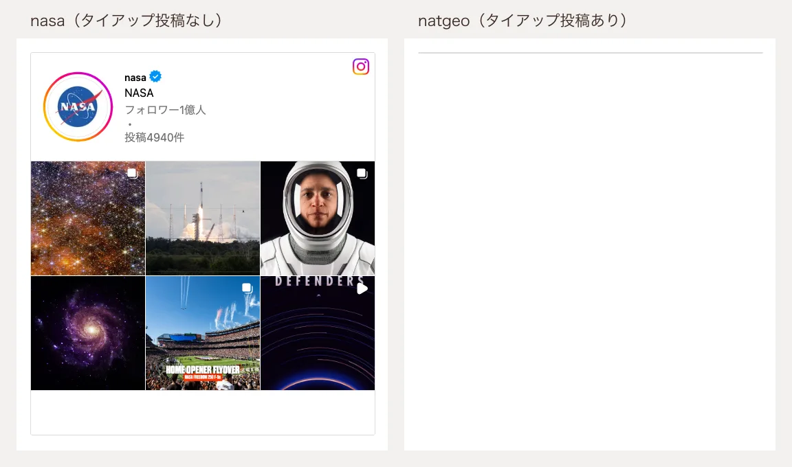

こんにちは、フリーランスエンジニアのmohです。

Instagram のプロフィール埋め込みが、何も表示しない線になることがあります。調べると、プロフィールに並ぶ最新 6 投稿の中にタイアップ投稿（「ブランドコンテンツ」「Paid partnership」のラベルが付いた投稿）があると、Instagram 側のスクリプトがエラーで止まっていました。埋め込む側のページの作りは関係ありません。

## 結論

- **空になる条件**: 最新 6 投稿にタイアップ投稿が 1 件でもあること。この状態のアカウントは、プロフィール埋め込みでは表示できません
- **影響しないもの**: 単体の投稿・リールの埋め込み（`/p/...` `/reel/...`）は、タイアップ投稿そのものでも表示されます
- **手を打つなら**: 投稿の埋め込みを並べる、または Instagram Graph API で自前に描く。どちらもタイアップ投稿の有無に左右されません

確認日は 2026 年 10 月 3 日です。Instagram 側が直せば状況は変わります。

## 症状

プロフィール URL を `blockquote` と embed.js で埋め込むと、iframe（`https://www.instagram.com/{username}/embed/`）は作られますが、中身の高さが 0 になります。embed.js は iframe から高さを受け取って伸ばす仕組みなので、ページ上には高さ 2px の線だけが残ります。



iframe の URL を単体でブラウザで開いても同じで、「Instagram」の文字しか出ません。埋め込む側の CSS や読み込み順を疑っても、ここで切り分けられます。

コンソールには次のエラーが出ます。

```
ErrorUtils caught an error:
Cannot read properties of undefined (reading 'id')
```

自分のサイトで同じ症状が出ていたら、まず iframe の URL を単体で開いてみてください。単体でも空なら、この記事の件に当たっている可能性が高いです。

## 条件の切り分け

表示されるアカウントと空になるアカウントを並べると、違いはタイアップ投稿の有無だけでした。

| アカウント | 最新 6 投稿のタイアップ投稿 | プロフィール埋め込み |
|---|---|---|
| natgeo | 1 件（@rolex） | 空（高さ 2px） |
| nasa | 0 件 | 表示（高さ 558px） |
| visitjapanjp | 0 件 | 表示（高さ 558px） |

位置情報の有無、投稿の種類（画像・カルーセル・リール）、共同投稿者の有無は、表示できるかどうかと対応していませんでした。

natgeo の @rolex とのタイアップ投稿を単体で埋め込むと、普通に表示されます。落ちるのは、プロフィール埋め込みで投稿の格子を組み立てる処理だけです。

## 原因

プロフィール埋め込みのページには、最新投稿のデータが JSON で入っています。タイアップ投稿には `is_paid_partnership: true` と、スポンサーの情報が付きます。実際に届いているスポンサー情報はこの形です（プロフィール画像の URL などは省略）。

```json
"edge_media_to_sponsor_user": {
  "edges": [
    { "node": { "id": "1165531538", "username": "rolex", "is_verified": true } }
  ]
}
```

一方、Instagram の配信スクリプトはスポンサーを取り出すとき、`node` の下にさらに `sponsor` という包みがある前提で `node.sponsor.id` を読んでいます。届くデータには `sponsor` が無いので、`undefined` の `id` を読んでエラーになり、格子の描画ごと止まります。スタックトレースにも、投稿データを変換する処理（`getPostFromGraphMediaInterface`）からスポンサー情報の変換に入ったところで落ちていることが出ています。

つまり、データの形とスクリプトの前提が食い違っている Instagram 側の不具合です。埋め込む側で直せる箇所はありません。

## 公式の対応範囲

Meta の [oEmbed のドキュメント](https://developers.facebook.com/docs/instagram-platform/oembed) は、対応する URL に「Profiles: https://www.instagram.com/{username}」を挙げています。対象外として書かれているのは次の 2 つだけです。

> Posts on private, inactive, and age-restricted Instagram accounts are not supported.
> Accounts that have disabled Embeds are not supported.

タイアップ投稿があると表示できない、という記述はありません。仕様ではなく不具合として扱ってよいと考えています。

ネットでも探しましたが、同じ症状の報告は見つかりませんでした。`polarisGetSponsorFromGraphSponsorTag`（落ちている関数の名前）や `edge_media_to_sponsor_user` で検索しても一致はゼロです。いつから起きているのか、Meta が把握しているのかは分かっていません。

## 似ているが別の話

「Instagram のプロフィールが埋め込めない」で検索すると、oEmbed API がプロフィール URL を「Invalid URL」（HTTP 400、subcode 2207047）で拒む話が出てきます（[Spotlight の記事](https://spotlightwp.com/instagram-embed-wordpress/)、[GitHub の issue](https://github.com/akoukovistas/xperience-community-meta-embeds/issues/8)）。

これは API を呼んだ段階で弾かれる話です。この記事の件は API を使わず、embed ページの iframe の中でスクリプトが落ちているので、原因が違います。API のエラーが出ていないのに空になっているなら、こちらの件を疑ってください。

## 対処

効く順に並べます。

1. **投稿の埋め込みを並べる。** 単体の投稿埋め込みはタイアップ投稿でも表示されるので、見せたい投稿の URL を個別に埋め込みます。最新投稿に自動で追従しない点は手間です
2. **Instagram Graph API で自前に描く。** 投稿の一覧を API で取ってきて、自分のページで格子を組みます。自分が管理するアカウントでないと使えず、アクセストークンの更新も必要です
3. **Meta に報告する。** 直るのを待つ方法です。直る時期は分かりません

タイアップのラベルを外せば表示される可能性はありますが、試していません。外せたとしても、次のタイアップ投稿でまた空になるので、対処にはならないと考えています。

プロフィール埋め込みを使っているサイトは、埋め込んだアカウントがタイアップ投稿をした時点で、知らないうちに空になります。埋め込みを置いたまま放っておく運用なら、上の 1 か 2 に切り替えておくのが安全です。
