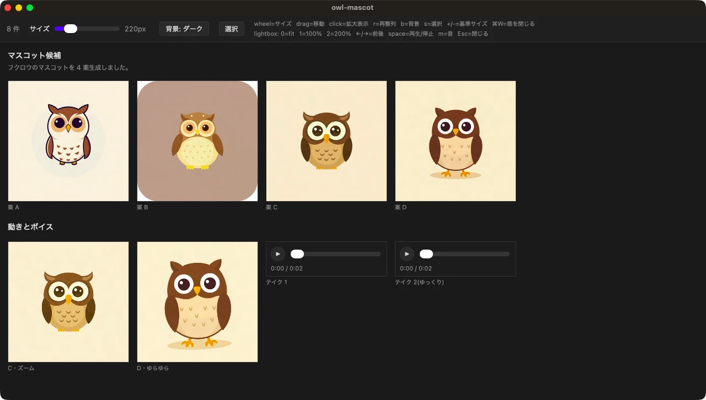

こんにちは、フリーランスエンジニアのmohです。

Claude Code などのエージェントが生成した画像・動画・音声を、1 つの窓に並べて見比べる macOS 用のビューア「moodboard」を公開しています。MIT のオープンソースです。

- GitHub: <https://github.com/mohhh-ok/moodboard>



## 作った理由

エージェントに画像や音声を作らせると、候補が何枚も出てきます。ファイルを 1 つずつ開いて見るのは手間で、エージェントに中身を文章で説明させても、見た目や聞こえ方は分かりません。

moodboard では、エージェントが生成物をライトテーブルに写真を並べるように 1 つの窓に並べ、人はそれを見比べて「これを残す」と返すだけです。

もとは [X 参加型の合戦ゲーム](/blog/posts/2026/06-10-aix参加型の合戦ゲームを作ってみた/)を作るときに、生成した画像を見比べるために書いたビューアです。それを独立したツールとして切り出し、動画・音声・選択モードなどを足していきました。

## 見られるもの

- **画像**: PNG / WebP / アニメーション GIF。ピクセル単位まで拡大でき、2 枚を重ねて比べられます。背景を市松模様にすると透過も確かめられます
- **動画**: mov / webm / mp4。並べた状態では無音でループ再生し、クリックで開くと音つきで見られます
- **音声**: wav / mp3 / m4a / aac / flac / ogg / opus。1 ファイルが 1 枚のプレイヤーカードになり、テイクを順に聞き比べられます

エージェントは、まとまりごとの見出しとカードごとの短いラベル（「今の本番」「撮り直し 2」など）を付けられます。何と何を比べているのかが窓の中で分かります。

## 入れ方

macOS と [bun](https://bun.sh) が必要です。コマンドを入れ、エージェントに使い方を教えるスキルを入れます。

```sh
bun install -g github:mohhh-ok/moodboard
npx skills add mohhh-ok/moodboard
```

スキルは [Agent Skills](https://github.com/anthropics/skills) の形式に沿っています。

## 使い方

あとはエージェントに「moodboard で見せて」「並べて比較して」と頼むと、生成物が並んだ窓が開きます。

同じ作業では同じ窓を使い回すので、作り直すたびに窓が増えることはありません。新しい結果が前の結果と入れ替わります。複数のプロジェクトやエージェントが同じマシンで動いていても、窓に名前を付けて分けるので混ざりません。

エージェントは窓が実際にファイルを読み込み終えたのを確かめてから「開きました」と返します。開けなかったファイルがあればそれも分かるので、表示に失敗したまま報告されることがありません。

## 窓での操作

- ホイール・ピンチで、カーソルの下のカードが大きくなります。ドラッグで好きな位置に動かせます
- クリックで原寸表示。`1` で等倍、`2` で 200%、矢印キーで前後に移ります。200% 以上ではピクセルをぼかさずに表示します
- `b` で背景を黒・市松模様・白と切り替えます
- `r` で元の並びに戻します

気に入ったものが見つかったら、エージェントにそのまま伝えます。カードを選んで渡すこともできます。`s` で選択モードにしてカードを選び、`⌘C` を押すと、選んだファイルの絶対パスが 1 行ずつクリップボードに入ります。それを会話に貼れば、どれを選んだかが正確に伝わります。

画面とエラーメッセージは日本語と英語に対応していて、macOS の言語設定に合わせて切り替わります。

## 気をつける点

- 動作を確かめているのは macOS だけです
- 透過付きの VP9 の `.webm` は再生できないことがあります。透過付きの HEVC の `.mov` は再生できます

## まとめ

エージェントに画像・動画・音声を作らせる人向けに、生成物を並べて選ぶための窓を作りました。不具合や要望は GitHub の issue にお願いします。
