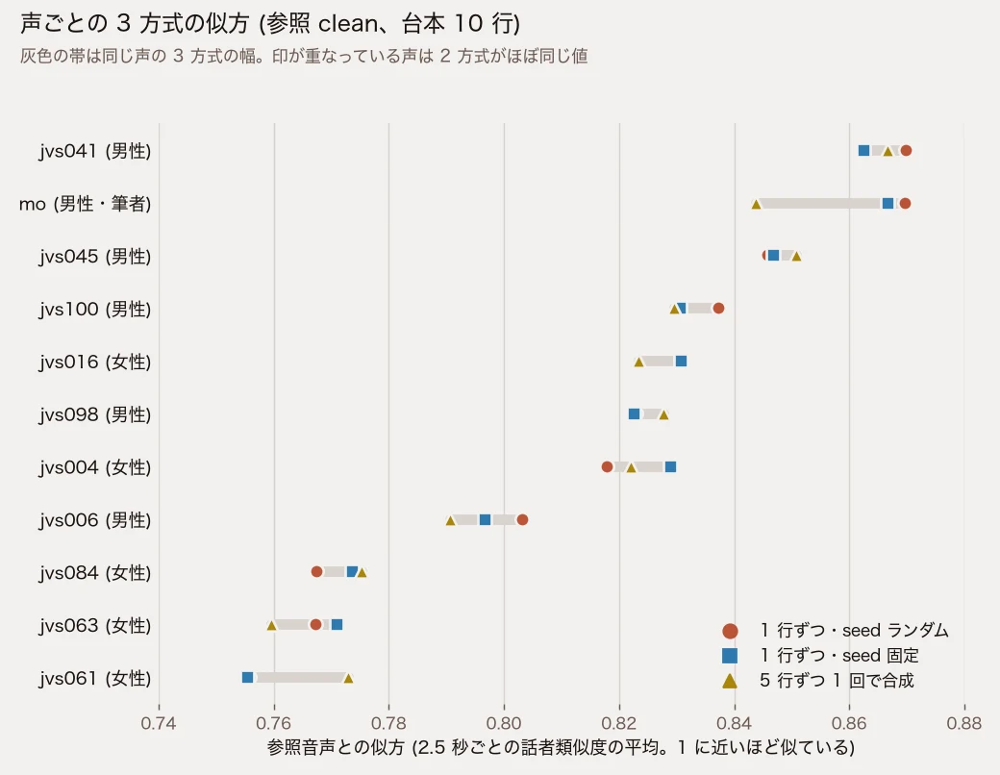

こんにちは、フリーランスエンジニアのmohです。この記事はほとんどAIが書いたものを、私が加筆修正しています。検証不十分な部分もあるかと思いますが、ご容赦ください。ご指摘等ございましたら、Github issueか、Xでお願いいたします。

台本を TTS で読ませるとき、1 行ずつ別々に合成すると、行ごとに尺や間を調整しやすくなります。ただ、以前 Fish Audio でこれをやったところ、行の境目で声が別人に入れ替わりました ([参照音声の密度の記事](/blog/posts/2026/08-26-aitts参照音声の密度で品質が決まる話mean_volumeとzero-shot-voice-clone/))。[日本語読みの記事](/blog/posts/2026/10-07-aiirodori-tts-v41の日本語読みと声クローンをfish-audioと比べた/)で試した Irodori-TTS v4.1-Small は seed を指定できるので、seed を固定すればランダムのときより行どうしの声がそろうのかも気になります。JVS コーパスの 10 人と私の声の計 11 声で測りました。

## 結論

- Irodori v4.1-Small は、1 行ずつ合成しても声が入れ替わる行は出ませんでした。11 声 × 参照の品質 3 条件 × 合成方式 3 通りの 99 条件のどれも、Fish で入れ替わったときの値に届いていません
- seed を全行で同じ値に固定しても、ランダムのときと比べて行どうしの声のそろい方は変わりませんでした。行ごとのばらつきが固定のほうで小さくなったのは 33 組中 17 組で、半々です
- 5 行をまとめて 1 回で合成しても、1 行ずつより声がそろうわけではありませんでした
- 似方は、合成方式よりも声によって大きく変わりました。同じ声の中での方式による差は、声どうしの差より小さく出ています
- Irodori で台本を読ませるなら、1 行ずつ合成で足ります。seed の固定や、行をまとめて合成する仕組みは、声をそろえる目的では要りません。耳で確かめるなら、2 秒前後の短い行を聴くのが効率的です

## きっかけ

Fish Audio で台本を 1 行ずつ合成したとき、ある行から急に別人の声になり、男声の参照から 400Hz を超える女声のような行も出ました。そのとき行の声を参照と比べた似方 (話者類似度、後述) は、崩れた条件で行の平均 0.71〜0.74、別人になった区間で 0.4〜0.6 でした。クリーンな参照なら 0.92 前後です。

Irodori の場合、同じ文・同じ参照・同じ seed なら毎回まったく同じ音声が出ることを、日本語読みの記事で確かめています。では違う文で seed を固定したら、ランダムのときより声はそろうのか。文ごとに Irodori が予測する出力の長さが違うので、同じ seed でも乱数の使われ方は文ごとに変わり、そろう保証はありません。測って確かめることにしました。

## 試した条件

| 項目 | 内容 |
|---|---|
| 声 | JVS コーパスの 10 人 (女性 5・男性 5) と、私の声 (mo) |
| 参照の品質 | clean (加工なし) / quiet (clean を -25 dB 下げる) / noisy (白色ノイズを足し、最も静かな 0.2 秒を -45 dB にする) |
| 合成方式 | 1 行ずつ・seed ランダム / 1 行ずつ・seed 固定 (全行 42) / 5 行ずつ 1 回で合成 |
| 台本 | 京都の旅行案内 10 行。「京都へようこそ。」(8 字) から 38 字の行まで |

JVS の 10 人は、コーパスに付いている話者ごとの声の高さの範囲から、男女それぞれ低い声から高い声まで散らばるように選びました。参照は各話者の発話を 2 つつないだ 16〜23 秒、私の声は日本語読みの記事と同じ 10 秒の録音です。

quiet は、Fish で声が入れ替わったときの原因として最も疑わしかった「参照の音量が小さい」状態を再現したものです。noisy は、[参照音声の下処理の記事](/blog/posts/2026/10-07-aiirodori-tts-v41の参照音声に下処理をかけると短い読み上げの前後に音が出た/)で短い入力の前後に音が出た参照と同じくらいのノイズの大きさにしています。

まとめて合成する方式は、10 行を 1 回にすると 35 秒になり、Irodori の出力の上限 30 秒で切れてしまいました。そこで 1〜5 行目と 6〜10 行目の 2 回に分けています。合計 726 本を RunPod の RTX 4090 で生成し、pod の時間は約 25 分、費用は約 $0.31 でした。

## 測り方

声の似方は、Fish のときと同じく resemblyzer という話者認識のモデルで測りました。音声ごとに声の特徴を 256 個の数値に変換し、参照との近さを 0〜1 の類似度で出します。1 に近いほど似ています。

1. 1 行ずつ合成した方式は、各行の参照との類似度と、行どうしの類似度を出す
2. 方式どうしを同じ単位で比べるため、3 方式とも音声をつないでから 2.5 秒ごとに区切り (1 秒ずつずらす)、各区間の参照との類似度を出す
3. 声の高さの急な変化を見るため、行ごとの基本周波数 (F0) の中央値を参照と比べる

## 結果

### 声が入れ替わる行の有無

1 行ずつ合成した 66 条件 (660 行) で、参照との類似度の最小は 0.64、条件の中での行のばらつき (標準偏差) の最大は 0.065 でした。Fish で入れ替わったときは、ばらつきが 0.10〜0.15 ありました。行の声の高さと参照の高さのずれも最大 5.7 半音 (1 オクターブは 12 半音) で、男声の参照から女声のような行が出ることはありませんでした。

類似度が 0.75 を下回った行は 660 行中 55 行あり、うち 49 行は「京都へようこそ。」(29 行) と「次は嵐山です。」(20 行) です。どちらも音声が 2 秒前後の、台本で最も短い 2 行でした。短い音声ほど話者の特徴が取りにくく、類似度も低めに出ます。

### seed を固定した場合

同じ声・同じ参照の品質の 33 組で、seed 固定とランダムを比べました。

| 比べた値 | 固定のほうが良かった組 |
|---|---|
| 条件の中での行のばらつきが小さい | 17 / 33 |
| 行どうしの類似度の平均が高い | 11 / 33 |

ばらつきでは半々、行どうしの類似度ではランダムのほうが良い組が多く、固定して得をしている傾向はありません。

### 3 方式の比較

3 方式を同じ 2.5 秒の区間で比べた結果です。値は 11 声をまとめたものです。

| 参照の品質 | 方式 | 参照との類似度の平均 | ばらつき | 0.75 未満の区間の割合 |
|---|---|---|---|---|
| clean | 1 行ずつ・seed ランダム | 0.817 | 0.026 | 9.5% |
| clean | 1 行ずつ・seed 固定 | 0.817 | 0.027 | 8.8% |
| clean | 5 行ずつ 1 回 | 0.815 | 0.027 | 7.9% |
| quiet | 1 行ずつ・seed ランダム | 0.801 | 0.026 | 9.6% |
| quiet | 1 行ずつ・seed 固定 | 0.799 | 0.027 | 9.6% |
| quiet | 5 行ずつ 1 回 | 0.803 | 0.026 | 7.2% |
| noisy | 1 行ずつ・seed ランダム | 0.811 | 0.026 | 8.3% |
| noisy | 1 行ずつ・seed 固定 | 0.807 | 0.028 | 9.9% |
| noisy | 5 行ずつ 1 回 | 0.808 | 0.028 | 12.7% |

同じ品質の中で、方式による平均の差は 0.002〜0.005 です。まとめて合成しても、区間ごとのばらつきは 1 行ずつと変わりません。

quiet は clean より平均が 0.012〜0.018 下がりましたが、崩れるほどではありません。Irodori は渡された参照の音量を合成前に -16 dB へそろえていて (生成時のメッセージに出ます)、小さい参照の影響を受けにくいのだと思います。

### 声ごとの違い

声ごとに 3 方式の平均を並べると、方式より声の差のほうが大きいのが分かります。

参照が clean のとき、平均は低い jvs061 で 0.755〜0.773、高い jvs041 で 0.863〜0.870 で、声どうしで 0.1 以上開きました。同じ声の中の 3 方式の幅は私の声以外で 0.005〜0.018、私の声で 0.026 です。私の声は、まとめて合成したとき (0.844) のほうが 1 行ずつ (0.870、0.867) より低く出ました。

声によって基準の高さが違うので、0.75 を下回ったら崩れた、という線は Irodori では使えません。崩れていないまとめて合成した音声でも、区間の 7〜13% は 0.75 を下回っています。Fish のときの 0.92 前後より全体に低いのも、崩れた音声が混じっているせいではないと見ています。どの声も方式によらずほぼ同じ高さに出ているので、モデルと声の組み合わせで基準の高さが決まっているようです。

## 聴き比べ

私の声 (参照 clean) で、台本 10 行を 3 方式で合成したものです。1 行ずつ合成した 2 つは、行の間に 0.4 秒の無音を挟んでつないでいます。

1 行ずつ・seed ランダム:

<audio controls src="https://raw.githubusercontent.com/mohhh-ok/blog-examples/main/2026/10-07-irodori-line-consistency/output/mo-clean-per-line-random.wav"></audio>

1 行ずつ・seed 固定:

<audio controls src="https://raw.githubusercontent.com/mohhh-ok/blog-examples/main/2026/10-07-irodori-line-consistency/output/mo-clean-per-line-fixed.wav"></audio>

5 行ずつ 1 回で合成:

<audio controls src="https://raw.githubusercontent.com/mohhh-ok/blog-examples/main/2026/10-07-irodori-line-consistency/output/mo-clean-run.wav"></audio>

JVS の 10 人については、元の音声も、その声を参照にした合成音声も載せていません。JVS の規約はブログでの個人利用と 10 本程度の元音声の掲載を認めていますが、その声で合成した音声の公開については書かれていないためです。

## 台本の分け方

Irodori v4.1-Small で台本を読ませるなら、1 行ずつ別々に合成してかまいません。今回の範囲では、それで声が入れ替わることはなく、seed を固定しても、行をまとめても、声のそろい方は変わりませんでした。行ごとに読み直したり尺を調整したりしやすい分、1 行ずつのほうが扱いやすいはずです。

seed を固定する意味は、同じ行を同じ音声で出し直せることにあります。行どうしの声をそろえる効果はありません。

確認に手間をかけるなら、2 秒前後の短い行を聴いてください。類似度が低く出た行の 9 割が、台本で最も短い 2 行でした。

## 手法と限界

- 生成は Irodori-TTS commit 89f9d8f、fp32、ステップ数と CFG はチェックポイント既定、参照の書き起こしは渡していません。日本語読みの記事と同じ設定です
- 声の似方は resemblyzer の類似度だけで判定しました。全 726 本を耳で聴いてはいません
- 台本は旅行案内の 10 行 1 本、seed 固定は 42 の 1 通りです。感情の起伏が大きい台本や、もっと長い台本は試していません
- 参照の品質は、音量を下げたものと白色ノイズを足したものの 2 通りです。残響や BGM の入った参照は試していません
- F0 は Praat の自己相関法 (parselmouth) で測った有声部分の中央値です

JVS コーパスは高道慎之介氏らが公開している日本語話者 100 人の音声コーパスで、規約 (コーパス同梱の README) は "Personal use, including blog posts." を認めています。再配布はできないので、参照音声と JVS の声で合成した音声はリポジトリに入れていません。話者の選び方と参照の作り方は `make_refs.py` にあり、手元の JVS コーパスから同じ参照を作れます。

生成・計測のコードと全条件の数値は [blog-examples](https://github.com/mohhh-ok/blog-examples/tree/main/2026/10-07-irodori-line-consistency) にあります。

## 参考

- [計測コード・結果 (blog-examples)](https://github.com/mohhh-ok/blog-examples/tree/main/2026/10-07-irodori-line-consistency)
- [Irodori-TTS v4.1 の日本語読みと声クローンを Fish Audio と比べた](/blog/posts/2026/10-07-aiirodori-tts-v41の日本語読みと声クローンをfish-audioと比べた/)
- [Irodori-TTS v4.1 の参照音声に下処理をかけると、短い読み上げの前後に音が出た](/blog/posts/2026/10-07-aiirodori-tts-v41の参照音声に下処理をかけると短い読み上げの前後に音が出た/)
- [TTS 参照音声の密度で品質が決まる話 (Fish Audio)](/blog/posts/2026/08-26-aitts参照音声の密度で品質が決まる話mean_volumeとzero-shot-voice-clone/)
- [JVS corpus](https://sites.google.com/site/shinnosuketakamichi/research-topics/jvs_corpus)
- [Irodori-TTS v4.1-Small (Hugging Face)](https://huggingface.co/Aratako/Irodori-TTS-v4.1-Small)
- [Irodori-TTS (GitHub)](https://github.com/Aratako/Irodori-TTS)
