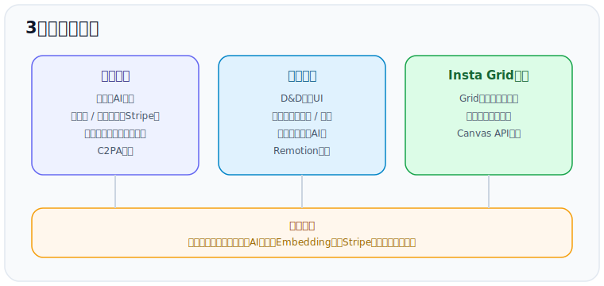
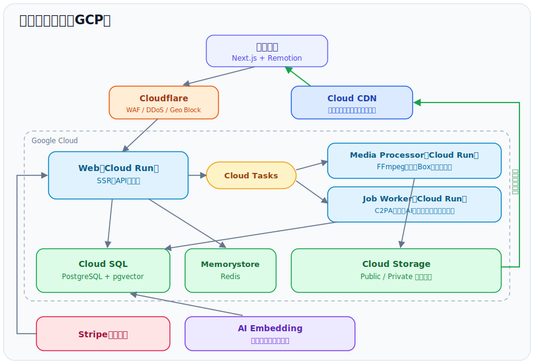

ショート動画メインの素材販売などの複合サービス。多言語対応。

2026年5月28日現在、保守・開発継続中

**サービス**

- 素材販売
- 動画編集
- Insta Grid編集

**開発**（初期デザイン以外を一人で担当）

- 要件定義・詳細設計
- 実装
- インフラ

## システム構成

## 素材販売

動画・画像の販売サービス。

### 特徴

- 画像や動画を多言語自由テキスト検索（AI Embedding）
- AIによるカテゴリ自動判定
- 関連画像・動画を表示
- カート機能・ポイント購入（Stripe）
- ユーザー投稿を見据えた設計（ユーザー単位の素材）
- ユーザー間のメッセージ
- バックグラウンド変換・ウォーターマーク付与・権限管理
- C2PA対応（証明書取得次第有効化）

### 技術

- ウォーターマーク付与とサイズ変換はFFmpeg
- pgvectorにEmbeddingを保存
- Cloud Tasksでキューを細かく分離しリトライ耐性を向上

## 動画編集

ドラッグ&ドロップで操作する動画編集UI。販売素材に加え、任意の素材も使用可能。

### 特徴

- シーンの追加・並べ替え・削除
- 画像・テキスト・スタンプ・Lottieの複数レイヤー
- 音声埋め込み
- 字幕起こし（AI）
- テンプレート保存・共有

### 技術

- Remotionでのフロントエンド変換
- 独自スキーマでのデータ保持
- 素材Variantの自動切り替え
- ブラウザにデータを保存して速度向上

## Insta Grid編集

InstagramでのGrid投稿をサポート

### 特徴

- 素材の追加・削除（販売素材・ユーザーアップロード）
- ドラッグで配置・リサイズ
- Grid分割結果のダウンロード

### 技術

- Canvas APIによる分割
