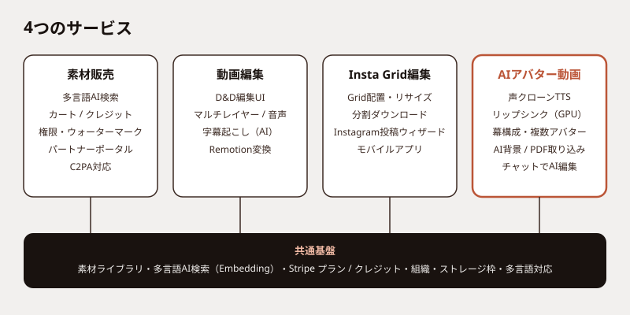
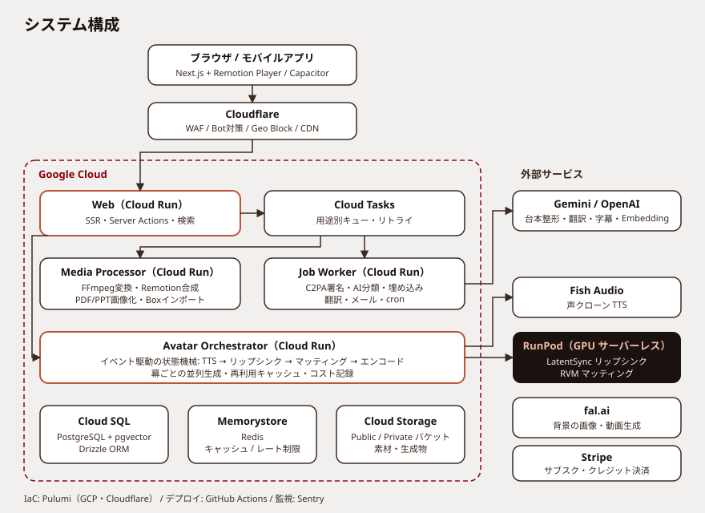

ショート動画メインの素材販売と、動画編集・AI アバター動画生成の複合サービス。多言語対応。

2026年9月17日現在、保守・開発継続中

**サービス**

- 素材販売
- 動画編集
- Insta Grid 編集
- AI アバター動画生成（2026年9月に本番公開）

**開発**（初期デザイン以外を一人で担当）

- 要件定義・詳細設計
- 実装
- インフラ・運用

## システム構成

## AI アバター動画生成

台本を書くと、選んだアバターがクローンした声で喋る動画ができる。スマホでも使える簡易エディタ。

### 特徴

- 公開ストックアバターから選択、または自分の素材をアップロード
- 台本の AI 整形（箇条書きや誤字混じりの入力を発話文にする）
- 参照音声からの声クローン TTS
- リップシンク（口の動きを音声に同期）
- 幕構成で最大 3 人のアバターの掛け合い
- 背景はライブラリ・アップロード・AI 生成（画像・動画）から選択
- PDF / PPT を取り込んで幕の背景にし、スライド内容から台本を自動生成
- 字幕の自動生成
- テンプレートの公開・複製、ログイン不要の共有リンク
- チャット（テキスト・音声）で AI に幕・台本・背景・配置を編集させる

### 技術

- アバターレイヤー生成と合成の 2 層構造。背景や配置だけの変更では GPU を再生成しない
- GPU 推論（リップシンク・マッティング）は RunPod サーバーレス、Cloud Run のオーケストレーターがイベント駆動の状態機械でジョブを進行
- TTS は Fish Audio API。読み間違い対策にかな化と読み検証ゲート
- 背景生成は fal.ai、台本整形・翻訳・字幕は Gemini / OpenAI
- 合成は Remotion のサーバーレンダリング。アバターは VP9 alpha で保持し幕単位に分割レンダー
- 外部 API のコストをジョブ単位で記録し、管理画面で集計
- 台本の禁止ワード監査、素材の公開申請ロール、モデルの意向設定（フリーメール禁止など）

## 素材販売

動画・画像の販売サービス。

### 特徴

- 画像や動画を多言語自由テキスト検索（AI Embedding）
- AI によるカテゴリ自動判定
- 関連画像・動画を表示
- カート機能・クレジット購入（Stripe）
- 撮影パートナー・モデルの紹介ページと制作リクエスト
- ユーザー間のメッセージ
- バックグラウンド変換・ウォーターマーク付与・権限管理
- C2PA 対応（証明書取得次第有効化）

### 技術

- ウォーターマーク付与とサイズ変換は FFmpeg
- pgvector に Embedding を保存
- Cloud Tasks でキューを細かく分離しリトライ耐性を向上
- Box からの素材インポートとパートナー自動紐づけ

## 動画編集

ドラッグ&ドロップで操作する動画編集 UI。販売素材に加え、任意の素材も使用可能。

### 特徴

- シーンの追加・並べ替え・削除
- 画像・テキスト・スタンプ・Lottie の複数レイヤー
- 音声埋め込み
- 字幕起こし（AI）
- 部分ぼかしなどのエフェクト
- テンプレート保存・共有

### 技術

- Remotion でのフロントエンド変換
- 独自スキーマでのデータ保持
- 素材 Variant の自動切り替え
- ブラウザにデータを保存して速度向上

## Insta Grid 編集

Instagram での Grid 投稿をサポート。

### 特徴

- 素材の追加・削除（販売素材・ユーザーアップロード）
- ドラッグで配置・リサイズ
- Grid 分割結果のダウンロード
- 1 マスずつ Instagram へ投稿するウィザード
- 未登録でも試せるトライアル

### 技術

- Canvas API による分割
- Capacitor でモバイルアプリ化（写真ロールへの保存、タッチ操作）

## 課金・アカウント基盤

- Stripe サブスクリプションとクレジット制。消費・返金を一元管理
- 組織単位のクレジットプールと共有素材
- 素材・テンプレートをまたぐアカウント共通のストレージ枠
- メール・Google OAuth のログイン、2 段階認証

## 運用

- Cloudflare の WAF・Bot 対策・レート制限・Geo Block
- GCP と Cloudflare を Pulumi で IaC 管理、GitHub Actions でデプロイ
- Sentry でエラー監視、Vitest / Playwright でテスト
