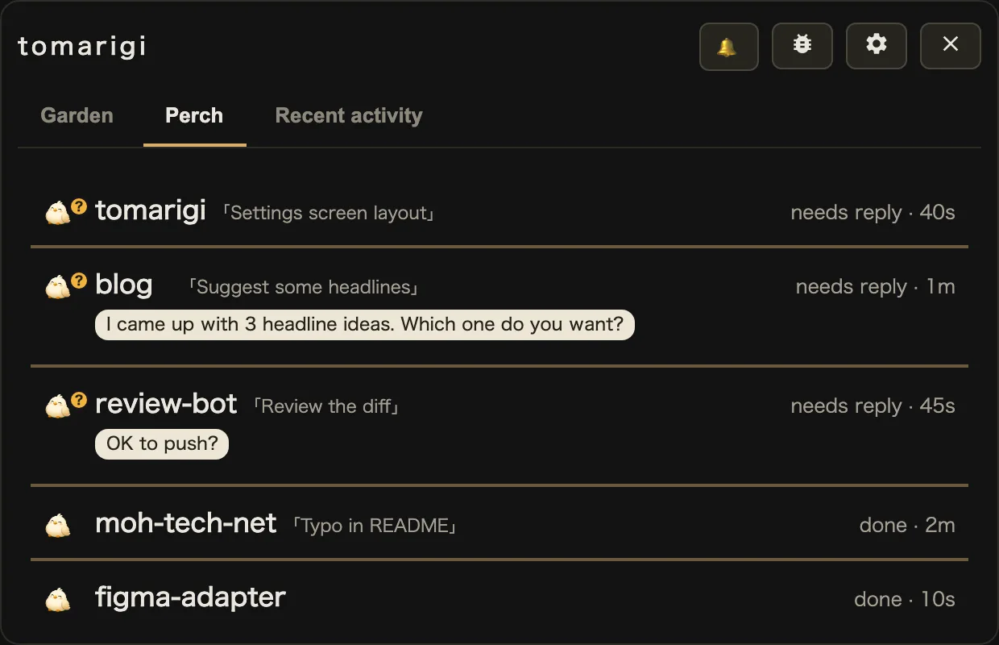

GitHub(macOS アプリ版 tomarigi-desktop): <https://github.com/mohhh-ok/tomarigi-desktop> (MIT)

Chrome Web Store: <https://chromewebstore.google.com/detail/tomarigi/jgkjejameolpmmnohlgahonfejfefjgp>

紹介ページ: <https://moh-tech.net/tomarigi/>

## 概要

Claude Code などの AI エージェントを走らせながら別の窓で作業していると、いま何をしているのか分からなくなる。止まり木の鳥たちがセッションごとの状態を仕草で表現し、ちらっと視線を送るだけで様子が分かるようにする。

2026/09 に公開した macOS アプリ版(tomarigi-desktop)が本命で、MIT のオープンソース。先に作った Chrome 拡張版もある。

## macOS アプリ版(tomarigi-desktop)

Tauri 2 で作った macOS アプリ。Claude Code と Codex のセッションを、常に最前面に置ける窓で見守る。

- 「にわ」(Garden) にセッションごとに 1 羽ずつ鳥がいて、作業中・返事待ち・完了のどれなのかを一目で見分けられる。鳥をクリックすると、その Claude Code が動いている Ghostty のペインに移動する
- エージェント側にフックや設定変更は要らない。`~/.claude/projects` と `~/.codex/sessions` のトランスクリプトを読むだけ
- 窓はフローティング(フルスクリーンのアプリの上にも出る)と標準ウィンドウ(最大化できる)を切り替えられる。背景は半透明のすりガラス
- Claude Code のセッション間メッセージで別のセッションに作業を渡して待っているセッションは「見守り中」になり、渡した先の鳥と一緒に角丸のブロックにまとまる
- アイコンは鳥・ノーム・猫・ロボット・カエルから選べる(画像は gpt-image で生成)。UI は 43 言語で、英語が基本

OpenAI / Anthropic / TypeSafe の API キーを入れると、次の機能が増える。キーは macOS のキーチェーンに保存する。

- ターンの終わりの返答が自分への質問かどうかを TypeSafe の Jev で判定し、鳥に「?」を付ける。キーが無いときは、入力待ちの状態のセッションにだけ「?」が付く
- ターンの終わりを要約したふきだし(聞かれている内容のふきだしは、質問ツールで止まっていればキーが無くても出る)
- 読み上げで、ターンの終わりの要約を読む(読み上げ自体はキーが無くてもオンにでき、そのときは最後の 1 文を読む)

動作環境は macOS で、ペインへの移動は Ghostty のみ対応。配布用のビルドはまだ無く、ソースからビルドして使う(手順は README)。

## Chrome 拡張版

鳥たちがセッションごとの状態(作業中 / 許可待ち / 立ち往生 / 完了 / うたた寝)を仕草で示す。Document Picture-in-Picture の小窓に切り替えれば、ターミナルの上に常時最前面で置ける。

- **サーバー・ネイティブ常駐なし**。File System Access API で `~/.claude/projects` などのフォルダを直接読み、ブラウザ内で完結する。複数フォルダを登録して並行監視できる
- **manifest 権限ゼロ**。API キーも不要で、状態判定はローカルヒューリスティックのみ
- 状態遷移は Web Audio の合成音で通知(音源ファイルなし・ミュート可)
- サブエージェントは親セッションの下に「ひな」として表示
- データソースはアダプタ化し、将来 Claude Code 以外のエージェントにも広げられる形にした
- 43 ロケール対応。`scripts/locales/*.mjs` に機能グループ単位で分割し、1キーごとに 43 ロケール分を inline で持つ形にしている。`gen:locales` で `public/_locales/` を再生成、`verify:locales` で全キー完全一致を強制
